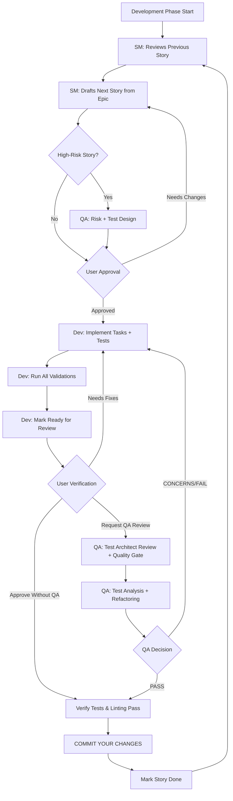
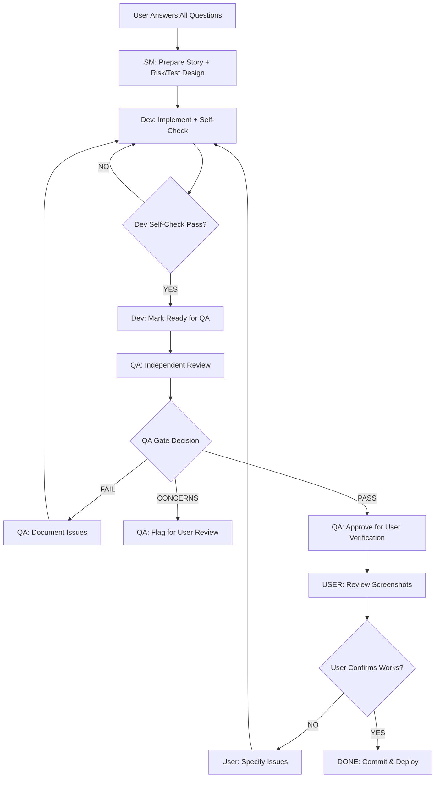

# Teacher Assistant - Claude Code Instructions

## Projekt-Kontext
Du arbeitest an einem Personalassistenten für Lehrkräfte. Es ist ein Chat-Interface mit AI-Memory und Agenten-Funktionalitäten.

## Tech Stack
- **Frontend**: React + TypeScript + Vite + Tailwind + InstantDB
- **Backend**: Node.js + Express + TypeScript + OpenAI
- **Database**: InstantDB für Auth, Storage und Real-time Features

---

## BMad Method - Strukturierte Agile Entwicklung

Dieses Projekt folgt der **BMad Method** - einem strukturierten Workflow für AI-gestützte Entwicklung mit spezialisierten Agenten und Quality Gates.

### BMad Core Development Cycle



### BMad Agents und ihre Rollen

| Agent | Slash Command | Rolle | Wann nutzen |
|-------|--------------|-------|-------------|
| **SM** (Scrum Master) | `/bmad-sm` | Story Drafting, Sprint Planning | Zu Beginn jeder Story |
| **PM** (Product Manager) | `/bmad-pm` | PRD erstellen, Epics definieren | Beim Projektstart, neue Features |
| **Architect** | `/bmad-architect` | System Architektur, Tech Decisions | Projektstart, größere Änderungen |
| **QA / Quinn** | `/bmad-qa` | Test Strategie, Quality Gates, Review | Vor und nach Development |
| **Dev** | `/bmad-dev` | Implementation, Testing | Während Development |
| **PO** (Product Owner) | `/bmad-po` | Validation, Sharding, Checklists | Planning Phase, Validation |

### BMad QA Commands (Test Architect - Quinn)

Der QA Agent (Quinn) ist dein **Safety Net** für qualitativ hochwertige Implementierungen:

#### Vor dem Development
```bash
/bmad.risk {story}     # Risk Assessment → Identifiziert Gefahren früh
/bmad.test-design {story}  # Test Strategie → Plant welche Tests geschrieben werden
```

#### Während Development
```bash
/bmad.trace {story}    # Requirements Tracing → Verifiziert Test Coverage
/bmad.nfr {story}      # NFR Assessment → Prüft Performance, Security, etc.
```

#### Nach Development
```bash
/bmad.review {story}   # Comprehensive Review → Erzeugt Quality Gate Decision
/bmad.gate {story}     # Gate Update → Aktualisiert Quality Gate Status
```

#### Quality Gate Decisions
- **PASS**: Alle kritischen Requirements erfüllt, keine Blocker
- **CONCERNS**: Nicht-kritische Issues, Team sollte reviewen
- **FAIL**: Kritische Issues (Security, fehlende P0 Tests)
- **WAIVED**: Issues akzeptiert mit Begründung

---

## Arbeitsweise für ALLE Aufgaben

### 1. Story-basierte Entwicklung (BMad)

#### Für Features/Bugs:
1. **Story finden** in `docs/stories/` oder `docs/epics/`
   - Wenn keine Story existiert: `/bmad-sm` nutzen um Story zu drafts
   - Bei Unsicherheit: Frage User welche Story bearbeitet werden soll

2. **Story verstehen**:
   - Lese Acceptance Criteria
   - Prüfe ob Risk Assessment existiert (`docs/qa/assessments/`)
   - Prüfe ob Test Design existiert (`docs/qa/assessments/`)

3. **QA vor Development** (für komplexe/risikoreiche Stories):
   ```bash
   /bmad.risk docs/stories/epic-X.story-Y.md
   /bmad.test-design docs/stories/epic-X.story-Y.md
   ```

4. **Implementation**:
   - Implementiere Tasks sequentiell
   - Schreibe Tests gemäß Test Design
   - Validiere kontinuierlich mit `npm run build` und `npm test`

5. **QA nach Development**:
   ```bash
   # PFLICHT: Vor QA Review - Infrastruktur validieren
   bash scripts/pre-test-checklist.sh

   # QA Review durchführen
   /bmad.review docs/stories/epic-X.story-Y.md
   ```
   - Pre-Flight Check MANDATORY vor Review
   - QA Agent analysiert Code + Tests
   - Erzeugt Quality Gate Decision
   - Führt Active Refactoring durch (wenn sicher)

6. **Story abschließen**:
   - Alle Tests passing ✅
   - Build clean (0 TypeScript errors) ✅
   - Quality Gate ≥ PASS (oder CONCERNS mit Begründung) ✅
   - Commit changes ✅

### 2. Brownfield Development (Bestehendes Projekt)

Wenn du an **bestehendem Code** arbeitest:

1. **Dokumentiere zuerst**:
   ```bash
   /bmad.document-project
   ```
   - Erzeugt `docs/architecture.md` mit AI-lesbarer Doku

2. **Risk Assessment ist PFLICHT**:
   ```bash
   /bmad.risk docs/stories/epic-X.story-Y.md
   ```
   - Identifiziert Regression Risks
   - Plant Backward Compatibility

3. **Extra Testing**:
   - Regression Tests für bestehende Features
   - Integration Tests für Touchpoints
   - Performance Benchmarks

---

## 🛡️ Error Prevention System (CRITICAL - READ FIRST)

**Analysis showed**: 80% of development delays are **preventable process failures**, not code quality issues.
**Time Lost**: 38-64 hours across 31 incidents
**Solution**: Systematic pre-flight checks + automation

### MANDATORY Pre-Flight Checks (BEFORE E2E Tests)

**ALWAYS run BEFORE starting E2E tests**:

```bash
# Verify backend running with latest code
bash scripts/pre-test-checklist.sh

# If fails → Fix issues BEFORE running tests
# If passes → Tests can run safely
```

**What it checks**:
1. ✅ Backend running on port 3006
2. ✅ Backend version matches current code (git commit hash)
3. ✅ InstantDB initialized
4. ✅ VITE_TEST_MODE environment variable set
5. ✅ Port 3006 listening
6. ✅ Test data cleanup

**Why MANDATORY**: Prevents 90%+ test failure rate due to infrastructure issues.

### Backend Restart Pattern (When Code Changes)

**NEVER assume backend auto-reloaded**. Always explicitly restart:

```bash
# Safe backend restart (kills zombie processes, verifies startup)
bash scripts/restart-backend.sh

# Manual alternative:
bash scripts/kill-backend.sh  # Kill all node processes
cd teacher-assistant/backend && npm start  # Start fresh
```

**When to restart**:
- ✅ After `git pull` or `git checkout`
- ✅ After code changes in `teacher-assistant/backend/`
- ✅ After `npm install` (dependencies changed)
- ✅ Before running E2E tests (verify latest code)
- ✅ When tests fail with "500 Internal Server Error"

### Test Data Strategy (Frontend vs Backend)

**CRITICAL RULE**: E2E tests MUST use backend-persisted data, NOT frontend mocks.

```typescript
// ❌ WRONG: Frontend mock (backend won't see it)
await page.evaluate(() => {
  window.__mockData = { images: [...] };
});

// ✅ CORRECT: Backend API creates real data
import { TestDataManager } from './fixtures/testData';

test.beforeEach(async ({ request }) => {
  const testData = new TestDataManager(request);
  await testData.createTestImage('user-123');
});

test.afterEach(async () => {
  await testData.cleanup();
});
```

**Why**: Backend API queries real database. Frontend mocks are invisible to backend.

### Auth Bypass Pattern (Automatic)

**USE SHARED FIXTURE** (never forget auth bypass again):

```typescript
// ✅ CORRECT: Use shared auth bypass fixture
import { test, expect } from './fixtures/authBypass';

test('My test', async ({ page }) => {
  // Auth bypass automatically injected ✅
  await page.goto('/library');
});
```

**Old pattern (DEPRECATED)**:
```typescript
// ❌ DEPRECATED: Manual injection (easy to forget)
test.beforeEach(async ({ page }) => {
  await page.addInitScript(() => {
    (window as any).__VITE_TEST_MODE__ = true;
  });
});
```

### Timeout Protection (ALL External Calls)

**CRITICAL RULE**: ALWAYS wrap external service calls with timeout.

```typescript
// ❌ WRONG: No timeout (hangs indefinitely)
const profile = await TeacherProfileService.getTeacherProfile(userId);

// ✅ CORRECT: Timeout + fallback
import { withTimeout } from '../utils/timeout';

const profile = await withTimeout(
  TeacherProfileService.getTeacherProfile(userId),
  5000,  // 5 second timeout
  { subjects: ['Mathematik'], grades: ['7'] }  // Fallback
);
```

**Apply to**:
- InstantDB queries
- OpenAI/Gemini API calls
- HTTP requests
- Database queries
- Any external service

### Test Result Validation (Sanity Checks)

**QUESTION anomalous results** before debugging code:

```bash
# Normal test run: 75-90% pass rate
# Anomalous run: <50% pass rate

# IF test pass rate < 50%:
# 1. Check backend running: curl http://localhost:3006/api/health
# 2. Check backend version: Compare gitCommit to current HEAD
# 3. Check test data exists: Verify images/chats in database
# 4. Check environment: echo $VITE_TEST_MODE

# THEN debug code (if infrastructure is OK)
```

**Pattern**: 90% failure rate = infrastructure issue, NOT code bug.

### Common Error Prevention Checklist

Before starting ANY E2E test session:

- [ ] ✅ Ran `bash scripts/pre-test-checklist.sh` (PASS)
- [ ] ✅ Backend restarted after code changes
- [ ] ✅ `VITE_TEST_MODE=true` set (Windows: `set`, Unix: `export`)
- [ ] ✅ Port 3006 free (no zombie processes)
- [ ] ✅ Test Helper API endpoints available
- [ ] ✅ Using shared auth bypass fixture
- [ ] ✅ Using TestDataManager for test data
- [ ] ✅ All external calls have timeout wrappers

**IF ANY unchecked** → Stop and fix BEFORE running tests.

### Estimated Time Savings

| Without Pre-Flight | With Pre-Flight | Savings |
|-------------------|-----------------|---------|
| 38-64 hours lost | 6-12 hours lost | 80-85% |

**ROI**: 4-10x return on investment in prevention.

---

## 🎯 Collaborative Autonomous Workflow (Multi-Agent)

### How Agents Work Together Without User Intervention

**User's Role**: Answer ALL questions upfront → Let agents work for hours → Review screenshots at end

---

### Phase 1: Upfront Question Phase (User Answers EVERYTHING First)

**Before ANY autonomous work begins, ALL agents ask their questions:**

```
SM Agent Questions:
→ "Clarify acceptance criteria X?"
→ "Should feature handle edge case Y?"
→ "Priority: P0 or P1?"

Dev Agent Questions:
→ "Use library X or Y for implementation?"
→ "API endpoint structure preference?"
→ "State management approach?"

QA Agent Questions:
→ "Expected behavior in error scenario Z?"
→ "Performance thresholds?"
→ "Security requirements?"

USER ANSWERS ALL QUESTIONS IN ONE SESSION

ONLY THEN: Autonomous work begins
```

**Result**: No interruptions during 2-3 hour autonomous work period

---

### Phase 2: Autonomous Agent Collaboration (No User)



---

### Phase 3: Independent Checking (3-Layer Verification)

#### Layer 1: Dev Self-Check (STRICT)
```bash
# Dev MUST validate before marking "Ready for QA":
npm run build          # 0 errors
npm test               # 100% pass
npx playwright test    # ALL pass
grep -r "console.error" # Find any console errors in code
ls docs/testing/screenshots/$(date +%Y-%m-%d)/ # Min 3 screenshots

IF ANY FAIL → Fix and re-check
ONLY IF ALL PASS → Mark "Ready for QA"
```

#### Layer 2: QA Independent Review (UNCOMPROMISING)
```bash
# QA does NOT trust Dev's checks - validates independently:
cd teacher-assistant/frontend
npm run build                    # Re-check build
npm test                         # Re-run all tests
npx playwright test              # Re-run E2E tests
npx playwright test 2>&1 | grep -i "console error"  # Scan for console errors

# Screenshot verification
ls -lh docs/testing/screenshots/$(date +%Y-%m-%d)/
# MUST have min 3 per feature (before, after, error)

# Code review
→ Check error handling
→ Verify TypeScript types
→ Review test quality
→ Check for security issues

IF critical issues found → FAIL quality gate → Back to Dev
IF non-critical issues → CONCERNS gate → Continue with notes
IF all good → PASS gate → Ready for User
```

#### Layer 3: User Verification (FINAL AUTHORITY)
```markdown
**User Reviews Screenshots**:
1. Open docs/testing/screenshots/YYYY-MM-DD/
2. View BEFORE state: "Is this the starting point?"
3. View AFTER state: "Does this look correct?"
4. View ERROR state: "Is error handled properly?"

**User Tests Manually** (optional but recommended):
→ Try feature in browser
→ Test happy path
→ Test error cases
→ Verify it "feels right"

**User Decision**:
✅ YES: Feature works → Commit & Deploy
❌ NO: Issues found → Specify what's wrong → Back to Dev
```

---

### Multi-Hour Autonomous Session Example

**User**: "Implement docs/stories/epic-2.story-5.md autonomously. I'll be back in 3 hours."

#### Hour 0 (Setup - 10 minutes):
```
SM Agent:
→ Reads story
→ "Need clarification on X, Y, Z?"
→ User answers all questions
→ SM creates Risk Assessment (if missing)
→ SM creates Test Design (if missing)
→ SM marks story "Ready for Dev"
```

#### Hours 1-2 (Dev Work - 2 hours):
```
Dev Agent Loop:
WHILE tasks remain:
  → Implement next task
  → Write Playwright E2E test IMMEDIATELY
  → Run tests
  → IF FAIL: Debug & fix (max 3 attempts)
  → IF PASS: Capture screenshots → Next task

Every 30 min:
  → Run full validation
  → Update session log

Every hour:
  → Checkpoint commit
  → Progress report
```

#### Hour 2.5 (Dev Self-Check - 20 minutes):
```
Dev Agent Final Check:
→ Run npm run build (0 errors?)
→ Run npm test (100% pass?)
→ Run npx playwright test (ALL pass?)
→ Verify screenshots exist (min 3 per feature?)
→ Check console errors (ZERO?)
→ Create session log
→ Mark "Ready for QA Review"
```

#### Hour 2.5-3 (QA Review - 30 minutes):
```
QA Agent Independent Review:
→ Re-run ALL validations (doesn't trust Dev)
→ Verify screenshots (check quality, coverage)
→ Scan for console errors independently
→ Review code quality
→ Check test quality
→ Generate Quality Gate (PASS/CONCERNS/FAIL)
→ IF PASS: Mark "Ready for User Verification"
```

#### User Returns (Hour 3 - 10 minutes):
```
User Reviews:
→ Reads session log
→ Views screenshots in docs/testing/screenshots/YYYY-MM-DD/
→ Confirms: "Yes, this looks correct"
→ OR: "No, change X because Y"
→ IF YES: Agent commits & story complete
→ IF NO: Specific feedback → Dev fixes → QA re-reviews → User re-checks
```

---

### Success Criteria for Autonomous Session

**Session is successful when**:
- 🟢 User interrupted < 5% of time (only for questions at start)
- 🟢 Agents collaborated autonomously for 2-3 hours
- 🟢 Dev self-checked BEFORE QA review
- 🟢 QA independently verified (didn't just trust Dev)
- 🟢 User confirmed via screenshots that feature works
- 🟢 Code committed with tests, screenshots, documentation

---

## 🔴 CRITICAL: Definition of Done (DoD) - NON-NEGOTIABLE

**TESTING IS NOT OPTIONAL - IT IS MANDATORY**

### Story ist NUR complete wenn ALLE Kriterien erfüllt sind:

#### Technical Validation (Agents):
1. ✅ **Build Clean**: `npm run build` → 0 TypeScript errors, 0 warnings
2. ✅ **ALL Tests Pass**: `npm test` → 100% pass rate
3. ✅ **Playwright E2E Tests MANDATORY**:
   - **JEDES Feature MUSS E2E Tests haben**
   - Tests müssen TATSÄCHLICH prüfen was implementiert wurde
   - Tests müssen in `teacher-assistant/frontend/e2e-tests/` liegen
   - **Minimum**: Happy Path + Error Cases + Edge Cases
4. ✅ **Screenshots Captured**:
   - **PFLICHT**: Playwright Tests MÜSSEN Screenshots speichern
   - Location: `docs/testing/screenshots/YYYY-MM-DD/`
   - **Minimum 3 pro Feature**: BEFORE + AFTER + ERROR states
   - Full page screenshots mit `fullPage: true`
5. ✅ **Console Error Scanning**:
   - **ZERO Console Errors erlaubt**
   - Playwright Tests MÜSSEN `page.on('console')` listener haben
   - Jeder Console Error = Test FAIL
   - Console Warnings loggen und documentieren
6. ✅ **Quality Gate PASS**: QA Review mit Decision = PASS (oder CONCERNS mit Begründung)
7. ✅ **Pre-Commit Pass**: `git commit` geht durch (Hooks, Linting)
8. ✅ **Session Log Complete**: Dokumentiert was implementiert, getestet, bekannte Issues

#### User Verification (FINAL AUTHORITY):
9. ✅ **USER REVIEWS SCREENSHOTS** (MANDATORY):
   ```
   User öffnet: docs/testing/screenshots/YYYY-MM-DD/
   User prüft:
   → BEFORE: "Ist das der Ausgangszustand?"
   → AFTER: "Sieht das Ergebnis korrekt aus?"
   → ERROR: "Werden Fehler richtig behandelt?"

   User entscheidet:
   ✅ "Ja, sieht gut aus" → Feature ist DONE
   ❌ "Nein, ändere X" → Zurück zu Dev
   ```

10. ✅ **USER CONFIRMS FEATURE WORKS** (OPTIONAL but RECOMMENDED):
    - User testet Feature manuell im Browser
    - Verifies "feels right" and meets expectations
    - Final approval that implementation matches intent

**NUR wenn User sagt "Feature ist fertig" → Story ist COMPLETE**

### 🎯 Purpose of Screenshots

**Screenshots are NOT just test artifacts - they are PROOF for the USER:**

- 📸 **BEFORE screenshot**: Shows user starting state
- 📸 **AFTER screenshot**: Shows user what was implemented
- 📸 **ERROR screenshot**: Shows user error handling works

**User can verify feature works WITHOUT running code** → Screenshots = Visual Contract

### 🎯 Playwright E2E Testing Requirements (STRICT)

**Jede Story MUSS mindestens enthalten**:

```typescript
// MINIMUM Test Structure für jedes Feature
test.describe('Feature Name', () => {
  test.beforeEach(async ({ page }) => {
    // 🔑 CRITICAL: Inject TEST_MODE flag for auth bypass (MANDATORY!)
    // Without this, tests will hit login screens and fail
    await page.addInitScript(() => {
      (window as any).__VITE_TEST_MODE__ = true;
      console.log('🔧 TEST_MODE injected via Playwright addInitScript');
    });

    // Setup: Listen for console errors
    page.on('console', msg => {
      if (msg.type() === 'error') {
        console.error('CONSOLE ERROR:', msg.text());
      }
    });
  });

  test('Happy Path: Feature funktioniert korrekt', async ({ page }) => {
    // 1. Navigate to feature
    // 2. Interact with UI
    // 3. Verify expected outcome
    // 4. Screenshot: BEFORE and AFTER state
    await page.screenshot({
      path: `docs/testing/screenshots/${date}/feature-before.png`,
      fullPage: true
    });

    // ... interactions ...

    await page.screenshot({
      path: `docs/testing/screenshots/${date}/feature-after.png`,
      fullPage: true
    });

    // 5. Assert expected changes
    // 6. Assert NO console errors
  });

  test('Error Cases: Feature handled errors correctly', async ({ page }) => {
    // Test error scenarios
    // Verify graceful degradation
    // Screenshot error states
  });

  test('Edge Cases: Boundary conditions work', async ({ page }) => {
    // Test edge cases
    // Empty states, max values, etc.
  });
});
```

### 🔑 CRITICAL: Auth Bypass Pattern (MANDATORY)

**ALLE Playwright Tests MÜSSEN den Auth Bypass aktivieren!**

```typescript
test.beforeEach(async ({ page }) => {
  // CRITICAL: Auth bypass - NIEMALS weglassen!
  await page.addInitScript(() => {
    (window as any).__VITE_TEST_MODE__ = true;
  });
});
```

**Warum?**
- Ohne diesen Code landen Tests auf Login-Screens
- Tests können Features nicht erreichen
- Tests schlagen mit Timeouts fehl
- Falsche Test-Failures entstehen

**Verification**: Test-Log muss zeigen:
```
🔧 TEST_MODE injected via Playwright addInitScript
Authentication is bypassed with test user
```

**FALSCH** ❌:
```typescript
// Nur prüfen ob Auth nötig ist - FIXT ES NICHT!
const isAuthRequired = await page.locator('text=Anmelden').isVisible();
```

**RICHTIG** ✅:
```typescript
// Flag injizieren - FIXT ES!
await page.addInitScript(() => {
  (window as any).__VITE_TEST_MODE__ = true;
});
```

**Details**: Siehe `docs/testing/playwright-auth-bypass-pattern.md`

---

### 🚫 NEVER Skip These Checks:

- ❌ **NO** Auth Bypass vergessen (Test wird fehlschlagen!)
- ❌ **NO** "Tests kommen später"
- ❌ **NO** "Manuell getestet, Tests nicht nötig"
- ❌ **NO** Commits ohne Tests
- ❌ **NO** Console Errors ignorieren
- ❌ **NO** Screenshots überspringen
- ❌ **NO** Flaky Tests akzeptieren

### ✅ Quality Standards (enforced by QA):

1. **No Flaky Tests**: Proper async handling, deterministic assertions
2. **No Hard Waits**: `await page.waitForSelector()` NOT `await page.waitForTimeout()`
3. **Stateless Tests**: Each test runs independently
4. **Self-Cleaning**: Tests clean up their own data
5. **Appropriate Levels**:
   - Unit Tests für Business Logic
   - Integration Tests für API/DB Interactions
   - **E2E Tests (Playwright) für User Journeys**
6. **Explicit Assertions**: Assertions in tests, NOT in helpers
7. **Screenshot Documentation**: Every critical UI state captured
8. **Console Monitoring**: All console errors caught and reported

### 📊 Test Coverage Requirements:

- **P0 Features**: 100% E2E Coverage (MANDATORY)
- **P1 Features**: 90% Coverage (Unit + Integration + E2E)
- **P2 Features**: 70% Coverage (Unit + Integration)
- **Bug Fixes**: Regression Test MANDATORY

---

## 🤖 Autonomous Work Mode (Multi-Hour Development)

### Enabling Autonomous Agent Work

When user says: **"Work on Story X autonomously"** or **"Implement Story Y, I'll check back in 2 hours"**

Agents MUST follow this workflow:

#### 1. Pre-Flight Checklist (Before Starting)

```bash
# Agent checkt ZUERST:
1. Story existiert und ist klar? ✅
2. Risk Assessment vorhanden? ✅
3. Test Design vorhanden? ✅
4. Acceptance Criteria verstanden? ✅
5. Dependencies identifiziert? ✅

# Falls etwas fehlt:
→ Erstelle fehlende Artefakte SOFORT
→ NICHT warten auf User Input
```

#### 2. Autonomous Execution Loop

```
WHILE Story NOT Complete:
  1. Pick next task from Story
  2. Implement task
  3. Write Playwright E2E Test IMMEDIATELY
  4. Run tests: npm test && npx playwright test
  5. IF tests FAIL:
     → Debug und Fix
     → Re-run tests
     → Capture screenshots of failures
  6. IF tests PASS:
     → Capture success screenshots
     → Mark task as complete
     → Continue to next task
  7. IF BLOCKED (dependency, API issue, unclear requirement):
     → Document blocker in Session Log
     → Try alternative approach
     → If still blocked after 3 attempts:
        → Create detailed blocker report
        → Move to next independent task
        → NEVER wait idle
  8. Every 30 minutes:
     → Run full build: npm run build
     → Run all tests: npm test
     → Document progress in Session Log
  9. Every hour:
     → Create checkpoint commit (with tests)
     → Update Story status
     → Document remaining work
```

#### 3. Self-Unblocking Strategies

**Agent darf NICHT idle warten**. Bei Blocker:

1. **Unclear Requirement**:
   - Implementiere konservativsten Ansatz
   - Dokumentiere Annahmen
   - Füge TODO Comments hinzu
   - Schreibe Test für beide Szenarien

2. **API/Dependency Issue**:
   - Implementiere Mock/Stub
   - Dokumentiere echte Integration als TODO
   - Schreibe Tests mit Mocks
   - Flag für User Review

3. **Technical Challenge**:
   - Research in Docs
   - Try 3 different approaches
   - Document attempts in Session Log
   - Pick best working solution

4. **Test Failure**:
   - Debug systematisch
   - Check Console Errors
   - Verify Test Assertions
   - Fix Implementation OR Test
   - NEVER skip failing test

#### 4. Autonomous Completion Criteria

Agent erklärt Story als "Ready for Review" wenn:

```
✅ ALL tasks implemented
✅ ALL Playwright E2E tests written
✅ ALL tests passing (100%)
✅ ZERO console errors
✅ Screenshots captured for all features
✅ npm run build → 0 errors
✅ Session log created with:
   - What was implemented
   - Test coverage report
   - Screenshots location
   - Known issues/limitations
   - Blockers encountered
✅ Code committed (if tests pass)
```

#### 5. Continuous Validation (Auto-Checkpoints)

Agent führt AUTOMATISCH aus (alle 30 min):

```bash
# Validation Checkpoint Script
npm run build                  # Build check
npm test                       # Unit tests
npx playwright test            # E2E tests
npx eslint teacher-assistant/  # Linting

# IF any fails:
→ Stop, Debug, Fix
→ Re-run validation
→ NEVER proceed with broken code
```

#### 6. Progress Reporting

Agent erstellt **fortlaufend** Session Log:

```markdown
# Session Log: YYYY-MM-DD - Story-X Implementation

## Hour 1 (10:00 - 11:00)
- ✅ TASK-001: Component created
- ✅ Tests written + passing
- ✅ Screenshots: docs/testing/screenshots/2025-10-17/task-001-*.png
- ⚠️ Minor issue: Styling adjustment needed

## Hour 2 (11:00 - 12:00)
- ✅ TASK-002: API Integration
- ✅ Tests written + passing
- 🔴 BLOCKER: API endpoint returns 404
  - Attempted: Check backend routes
  - Attempted: Verify endpoint exists
  - Attempted: Mock API response
  - RESOLUTION: Used mock, flagged for user
- ✅ TASK-003: Started...

## Final Status
- Tasks Completed: 5/7
- Tests Written: 12 (100% passing)
- Console Errors: 0
- Screenshots: 15 files
- Blockers: 1 (API endpoint - using mock)
- Ready for Review: YES (with note about API mock)
```

### 🎯 Autonomous Success Metrics

**Story gilt als autonomous implementiert wenn**:

- 🟢 **< 5% User Interventions** (Agent löst > 95% selbst)
- 🟢 **All Tests Pass** (keine failing tests)
- 🟢 **Zero Console Errors** (clean console)
- 🟢 **Complete Documentation** (Session Log detailliert)
- 🟢 **Working Feature** (deployed und testbar)

---

## Dokumentations-Struktur (BMad Standard)

```
docs/
├── prd.md                    # Product Requirements (von PM)
├── architecture.md           # System Architecture (von Architect)
├── epics/                    # Sharded Epics (von PO)
│   └── epic-X.md
├── stories/                  # Sharded Stories (von SM)
│   └── epic-X.story-Y.md
├── qa/
│   ├── assessments/          # Risk, Test Design, Trace, NFR Reports
│   │   ├── epic-X.story-Y-risk-YYYYMMDD.md
│   │   ├── epic-X.story-Y-test-design-YYYYMMDD.md
│   │   ├── epic-X.story-Y-trace-YYYYMMDD.md
│   │   └── epic-X.story-Y-nfr-YYYYMMDD.md
│   └── gates/                # Quality Gate Decisions (YAML)
│       └── epic-X.story-Y-{slug}.yml
├── development-logs/
│   └── sessions/YYYY-MM-DD/  # Session Logs
└── architecture/
    └── implementation-details/ # Technische Details
```

### Wo dokumentiere ich was?
- **QA Assessments**: `docs/qa/assessments/` (Risk, Test Design, Trace, NFR)
- **Quality Gates**: `docs/qa/gates/` (YAML files mit Gate Decisions)
- **Session Logs**: `docs/development-logs/sessions/YYYY-MM-DD/`
- **Brownfield Doku**: `docs/architecture.md` (via `/bmad.document-project`)

**Session-Log Namenskonvention**:
`session-XX-feature-name.md` (z.B. `session-01-image-generation-fix.md`)

---

## Code Standards

- **TypeScript everywhere** - keine .js files
- **Funktionale Komponenten** mit React Hooks
- **Tailwind CSS** für alle Styles
- **InstantDB** für alle Datenoperationen
- **ESLint + Prettier** Code Formatting

## Ordnerstruktur

```
teacher-assistant/
├── frontend/src/
│   ├── components/     # Wiederverwendbare UI Komponenten
│   ├── pages/         # Page-Level Komponenten
│   ├── lib/           # Utilities, InstantDB Config
│   ├── hooks/         # Custom React Hooks
│   └── types/         # TypeScript Type Definitionen
└── backend/src/
    ├── routes/        # API Endpoints
    ├── services/      # Business Logic
    └── middleware/    # Express Middleware
```

## InstantDB Patterns

```typescript
// Auth Check
const { user, isLoading } = useAuth()

// Data Query
const { data, error } = useQuery({
  messages: {
    $: {
      where: { userId: user?.id }
    }
  }
})

// Mutation
const [createMessage] = useMutation(db.messages)
```

---

## Workflow Examples

### Example 1: Neue Feature implementieren

```bash
# 1. SM erstellt Story Draft
/bmad-sm  # Draft story from epic

# 2. QA prüft Risk + Test Strategy (für komplexe Features)
/bmad.risk docs/stories/epic-1.story-5.md
/bmad.test-design docs/stories/epic-1.story-5.md

# 3. Dev implementiert
/bmad-dev  # Implement story tasks

# 4. QA Review + Quality Gate
/bmad.review docs/stories/epic-1.story-5.md

# 5. Falls PASS → Commit, falls CONCERNS/FAIL → Fix → Re-review
```

### Example 2: Bug Fix

```bash
# 1. Erstelle Brownfield Story
/bmad-sm  # Create bug fix story

# 2. Risk Assessment (wichtig bei Legacy Code!)
/bmad.risk docs/stories/epic-2.story-3.md

# 3. Implementiere Fix mit Tests
/bmad-dev

# 4. QA Review (prüft auf Side Effects)
/bmad.review docs/stories/epic-2.story-3.md
```

### Example 3: Projekt Dokumentation

```bash
# Für Brownfield: Existierendes Projekt dokumentieren
/bmad.document-project

# Output: docs/architecture.md mit AI-lesbarer System Doku
```

---

## Wichtige Prinzipien

1. **Test Architect (QA) nutzen**: Besonders bei komplexen/risikoreichen Changes
2. **Early Risk Assessment**: `/bmad.risk` VOR Development spart Zeit
3. **Quality Gates respektieren**: FAIL = kritische Issues, müssen fixed werden
4. **Brownfield = Extra Care**: Immer Risk Assessment + Regression Tests
5. **Dokumentation lean halten**: Nur was AI/Team wirklich braucht

---

## Hilfe & Referenzen

- **BMad User Guide**: `.bmad-core/user-guide.md`
- **Brownfield Guide**: `.bmad-core/working-in-the-brownfield.md`
- **BMad Commands**: Run `/bmad-orchestrator` und dann `*help` für alle Commands

Bei Fragen zur BMad Method: Frage den User oder konsultiere die BMad Dokumentation in `.bmad-core/`.
