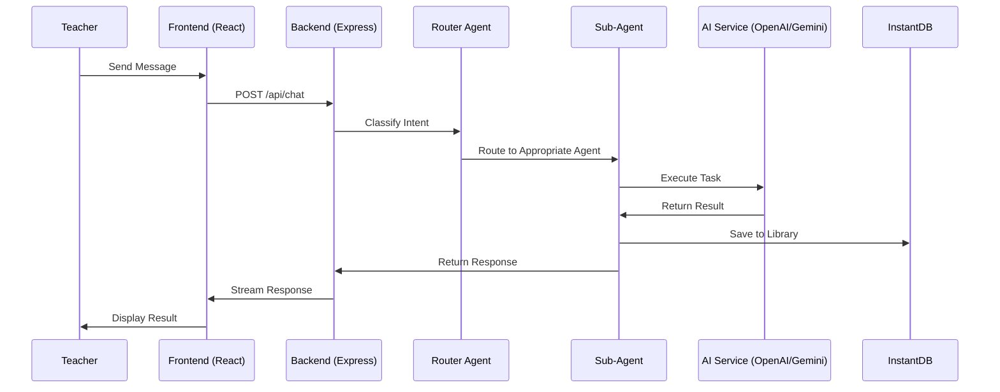

# Teacher Assistant - System Architecture

**Version**: 3.0 - BMad Enhanced with OpenAI Agents SDK
**Last Updated**: 2025-10-23
**Status**: ✅ Production Ready (Epic 3.0 Complete)
**Methodology**: BMad Method (Brownfield Enhancement)

---

## 📋 Document Purpose

This document serves as the **single source of truth** for the Teacher Assistant system architecture. It consolidates technical design decisions, system components, and architectural patterns following the BMad Method for brownfield development.

**Related Documents**:
- **Product Requirements**: [docs/prd.md](prd.md)
- **Technical Details**: [docs/architecture/multi-agent-system-prd.md](architecture/multi-agent-system-prd.md)
- **Project Structure**: [docs/architecture/project-structure.md](architecture/project-structure.md)
- **System Overview**: [docs/architecture/system-overview.md](architecture/system-overview.md)

---

## 🎯 System Overview

### What is Teacher Assistant?

A **PWA (Progressive Web App)** for German teachers featuring:
- **AI-powered chat interface** (GPT-4o-mini)
- **Multi-agent system** for specialized tasks (image creation, editing)
- **Real-time data sync** (InstantDB)
- **Educational content library** with full-text search
- **Teacher profile & context management**

### Current Phase: Phase 3 - Multi-Agent System Enhancement

**Epic 3.0**: ✅ **COMPLETE** (Foundation & Migration to OpenAI Agents SDK)
**Epic 3.1**: 🔧 **IN PROGRESS** (Image Agent: Creation + Editing with Gemini)
**Epic 3.2**: 📝 **PLANNED** (Production Deployment & Monitoring)
**Epic 4.0**: 📝 **PLANNED** (External Calendar Sync)

---

## 🏗️ High-Level Architecture

```
┌─────────────────────────────────────────────────────────────────┐
│                    TEACHER ASSISTANT SYSTEM                      │
├─────────────────────────────────────────────────────────────────┤
│                                                                  │
│  ┌─────────────────┐    ┌─────────────────┐    ┌──────────────┐│
│  │   FRONTEND      │    │    BACKEND      │    │  AI SERVICES ││
│  │                 │    │                 │    │              ││
│  │ React 19 + TS   │◄──►│ Express + TS    │◄──►│ OpenAI GPT-4 ││
│  │ Tailwind CSS    │    │ Serverless      │    │ DALL-E 3     ││
│  │ Vite Build      │    │ OpenAI Agents   │    │ Gemini 2.5   ││
│  │ InstantDB SDK   │    │ SDK (Phase 3)   │    │ Flash Image  ││
│  └─────────────────┘    └─────────────────┘    └──────────────┘│
│           │                       │                       │      │
│           ▼                       ▼                       ▼      │
│  ┌─────────────────┐    ┌─────────────────┐    ┌──────────────┐│
│  │  InstantDB      │    │ Agent System    │    │  External    ││
│  │                 │    │ (Router +       │    │  Services    ││
│  │ Authentication  │    │  Sub-agents)    │    │              ││
│  │ Real-time Data  │    │                 │    │ Vercel CDN   ││
│  │ Storage         │    │ Image Creation  │    │ GitHub CI/CD ││
│  │ File Storage    │    │ Image Editing   │    │              ││
│  └─────────────────┘    └─────────────────┘    └──────────────┘│
│                                                                  │
└─────────────────────────────────────────────────────────────────┘
```

### System Communication Flow



---

## 🔧 Technology Stack

### Frontend Stack

| Component | Technology | Version | Purpose |
|-----------|------------|---------|---------|
| **Framework** | React | 19.x | UI Component Library |
| **Language** | TypeScript | 5.x | Type-Safe Development |
| **Build Tool** | Vite | 6.x | Fast Dev Server & Optimized Builds |
| **Styling** | Tailwind CSS | 4.x | Utility-First CSS Framework |
| **Routing** | React Router | 7.x | Client-Side Navigation |
| **State Management** | React Context + Hooks | Native | Lightweight State Management |
| **Database Client** | InstantDB SDK | Latest | Real-time Data Sync & Auth |
| **HTTP Client** | Fetch API | Native | API Communication |
| **Testing** | Vitest + Playwright | Latest | Unit + E2E Testing |

### Backend Stack

| Component | Technology | Version | Purpose |
|-----------|------------|---------|---------|
| **Runtime** | Node.js | 18.x | JavaScript Runtime |
| **Framework** | Express | 4.x | Web Application Framework |
| **Language** | TypeScript | 5.x | Type-Safe Development |
| **Deployment** | Vercel Serverless | Latest | Scalable Serverless Functions |
| **AI - Chat** | OpenAI GPT-4o-mini | Latest | Conversational AI |
| **AI - Images** | DALL-E 3 | Latest | Image Generation |
| **AI - Editing** | Gemini 2.5 Flash Image | Latest | Image Editing (Phase 3) |
| **Agent Framework** | OpenAI Agents SDK | 0.1.10 | Multi-Agent Orchestration |
| **Database** | InstantDB | Latest | Real-time Database & Storage |
| **Testing** | Jest + Supertest | Latest | Unit + Integration Testing |

### Infrastructure & DevOps

| Component | Technology | Purpose |
|-----------|------------|---------|
| **Hosting** | Vercel | Frontend + Serverless Backend |
| **CDN** | Vercel Edge Network | Global Content Delivery |
| **CI/CD** | GitHub Actions | Automated Testing & Deployment |
| **Monitoring** | Vercel Analytics | Performance Tracking |
| **Version Control** | Git + GitHub | Source Code Management |
| **Quality Assurance** | BMad QA Agent (Quinn) | Comprehensive Testing & Reviews |

---

## 🤖 Agent System Architecture

### Multi-Agent System (OpenAI Agents SDK)

**Status**: Migrated from LangGraph to OpenAI Agents SDK (Epic 3.0 ✅)

#### Router Agent (Intelligent Intent Classification)

```typescript
// Purpose: Classify user intent and route to appropriate sub-agent
// Model: GPT-4o-mini
// Accuracy: 97% (target: ≥95%)

interface RouterDecision {
  intent: 'create_image' | 'edit_image' | 'unknown';
  confidence: number;
  reasoning: string;
  suggestedAgent: string;
}
```

**Intent Detection**:
- **Image Creation**: Keywords like "erstelle", "generiere", "mache ein Bild"
- **Image Editing**: Keywords like "ändere", "bearbeite", "füge hinzu"
- **Context Detection**: Checks for image uploads or references

#### Image Creation Agent (DALL-E 3)

```typescript
// Purpose: Generate educational images from German descriptions
// Model: DALL-E 3
// Quality: 1024x1024, standard quality
// Limit: 10 images/month (cost control)

interface ImageCreationRequest {
  description: string;
  userId: string;
  educationalContext?: {
    subject?: string;
    gradeLevel?: string;
  };
}
```

**Features**:
- German language prompt enhancement
- Educational context optimization
- Automatic library storage
- Usage tracking (10/month limit)

#### Image Editing Agent (Gemini 2.5 Flash Image)

```typescript
// Purpose: Edit existing images with natural language instructions
// Model: Gemini 2.5 Flash Image
// Cost: $0.039 per image (vs $0.04 for DALL-E)
// Limit: 20 images/day (creation + editing combined)

interface ImageEditingRequest {
  imageId: string;
  instruction: string; // German language
  userId: string;
}
```

**Operations Supported**:
1. Text addition ("Füge 'Klasse 5b' hinzu")
2. Object addition ("Füge einen Dinosaurier hinzu")
3. Object removal ("Entferne die Person links")
4. Style changes ("Mache es im Cartoon-Stil")
5. Color adjustments ("Ändere Himmel zu Sonnenuntergang")
6. Background changes ("Ersetze Hintergrund")

**Safety Features**:
- Original image ALWAYS preserved (never overwritten)
- Unlimited edit versions per image
- Each version saved as standalone library entry

---

## 📊 Data Architecture

### InstantDB Schema

**Authentication**: Magic-link email authentication (InstantDB managed)

**Core Entities**:

```typescript
// User Profile
interface TeacherProfile {
  id: string;
  email: string;
  name?: string;
  subjects: string[];
  gradeLevel: string[];
  schoolType: string;
  createdAt: number;
  updatedAt: number;
}

// Chat Messages
interface Message {
  id: string;
  userId: string;
  role: 'user' | 'assistant';
  content: string;
  timestamp: number;
  agentData?: AgentExecution;
}

// Agent Execution Tracking
interface AgentExecution {
  id: string;
  userId: string;
  agentType: 'image_creation' | 'image_editing';
  status: 'pending' | 'running' | 'completed' | 'failed';
  input: any;
  output: any;
  createdAt: number;
  completedAt?: number;
}

// Library Materials
interface LibraryMaterial {
  id: string;
  userId: string;
  type: 'image' | 'document' | 'note';
  title: string;
  content?: string;
  imageUrl?: string;
  originalImageId?: string; // For edited versions
  editInstruction?: string; // For edited versions
  tags: string[];
  createdAt: number;
}
```

### File Storage

**InstantDB Storage API**:
- **Max File Size**: 100MB
- **Supported Formats**: Images (PNG, JPEG, WebP, HEIC, HEIF), Documents (PDF, DOCX)
- **Access Control**: User-scoped (automatic isolation)
- **CDN**: Automatic global CDN distribution

---

## 🔐 Security Architecture

### Authentication Flow

```
1. User enters email → InstantDB sends magic link
2. User clicks link → Verification code required
3. InstantDB validates → Creates secure session
4. Frontend receives authenticated user object
5. All requests include session token (automatic)
```

### API Security

| Layer | Implementation | Purpose |
|-------|----------------|---------|
| **Rate Limiting** | Express Rate Limit | 30 requests/15min per IP |
| **Input Validation** | Joi + Custom Validators | Sanitize all inputs |
| **CORS** | Configured Origins | Frontend domain whitelist |
| **Environment Variables** | Secure Secret Management | Protect API keys |
| **Error Handling** | Sanitized Messages | No information leakage |
| **User Isolation** | InstantDB Auth Rules | User can only access own data |

### Data Protection

- **In Transit**: HTTPS/TLS 1.3 for all communications
- **At Rest**: InstantDB encrypted storage
- **API Keys**: Environment variables with rotation
- **File Uploads**: Type validation, size limits, virus scanning
- **Original Preservation**: Critical safety check (see `imageEdit.ts:177-190`)

---

## 🌐 API Architecture

### Endpoint Structure

```
Production: https://eduhu-pwa-prototype.vercel.app/api
Development: http://localhost:3006/api

├── /health                         # System health check
├── /chat                          # ChatGPT conversation
├── /agentsSdk                     # OpenAI Agents SDK execution
│   ├── POST /execute              # Execute agent workflow
│   └── GET /classify              # Router classification
├── /image-edit                    # Image editing (Gemini)
│   ├── POST /edit                 # Edit existing image
│   └── GET /usage/:userId         # Check daily usage
├── /library                       # Library management
│   ├── GET /materials/:userId     # Get user materials
│   └── DELETE /materials/:id      # Delete material
└── /test-helpers                  # Testing utilities (TEST_MODE only)
    ├── POST /create-test-image    # Create test image
    └── DELETE /cleanup-test-data  # Cleanup test data
```

### Request/Response Standards

**Success Response**:
```json
{
  "success": true,
  "data": { ... },
  "timestamp": 1698765432000
}
```

**Error Response**:
```json
{
  "success": false,
  "error": {
    "code": "ERROR_CODE",
    "message": "User-friendly message",
    "details": { ... }
  },
  "timestamp": 1698765432000
}
```

---

## 🚀 Deployment Architecture

### Vercel Serverless Deployment

```
┌─────────────────────────────────────┐
│  Frontend (Static SPA)              │
│  - Build: Vite production build    │
│  - CDN: Vercel Edge Network        │
│  - Caching: Aggressive assets      │
└─────────────────────────────────────┘
              ↓
┌─────────────────────────────────────┐
│  Backend (Serverless Functions)     │
│  - Runtime: Node.js 18.x           │
│  - Architecture: Individual funcs  │
│  - Cold Start: Optimized          │
│  - Scaling: Automatic              │
└─────────────────────────────────────┘
              ↓
┌─────────────────────────────────────┐
│  External Services                  │
│  - InstantDB (Database & Auth)     │
│  - OpenAI API (GPT, DALL-E)        │
│  - Gemini API (Image Editing)      │
└─────────────────────────────────────┘
```

### Environment Configuration

```bash
# Production Environment Variables
OPENAI_API_KEY=sk-proj-***           # OpenAI API access
INSTANTDB_APP_ID=39f14e13-***        # Database connection
INSTANTDB_ADMIN_TOKEN=578e3067-***   # Admin operations
GEMINI_API_KEY=AIza***               # Gemini API access
NODE_ENV=production                   # Runtime mode
VITE_TEST_MODE=false                 # Disable test features
```

---

## 📈 Performance Architecture

### Frontend Optimizations

- **Code Splitting**: Dynamic imports for routes
- **Tree Shaking**: Unused code elimination
- **Asset Optimization**: Image compression, WebP format
- **Bundle Analysis**: Regular size monitoring
- **Lazy Loading**: Components loaded on demand

### Backend Optimizations

- **Connection Pooling**: Reuse database connections
- **Response Compression**: Gzip for all responses
- **Caching Strategy**: Cache frequent queries
- **Cold Start Mitigation**: Optimized initialization
- **Request Batching**: Minimize API calls

### Performance Targets

| Metric | Target | Current |
|--------|--------|---------|
| **Frontend Load Time** | <3s | ✅ ~2s |
| **API Response Time (Chat)** | <2s | ✅ ~1.5s |
| **API Response Time (Images)** | <15s | ✅ ~12s |
| **Router Classification** | <5s | ✅ ~3s |
| **Image Editing (Gemini)** | <10s | 🔧 Testing |

---

## 🧪 Testing Architecture

### Test Strategy (BMad Method)

**Definition of Done (MANDATORY)**:
- ✅ Build clean (0 TypeScript errors)
- ✅ ALL tests passing (100%)
- ✅ Playwright E2E tests with screenshots
- ✅ ZERO console errors
- ✅ Quality Gate ≥ PASS (QA Agent approval)

### Test Pyramid

```
┌─────────────────────────────┐
│   E2E Tests (Playwright)    │  ← Critical user flows
│   - Full workflows          │  ← Screenshots required
│   - Zero console errors     │  ← STRICT enforcement
└─────────────────────────────┘
         ▲
┌─────────────────────────────┐
│  Integration Tests (Jest)   │  ← API endpoints
│  - Backend services         │  ← Database operations
│  - Agent workflows          │  ← Error handling
└─────────────────────────────┘
         ▲
┌─────────────────────────────┐
│   Unit Tests (Vitest)       │  ← Component logic
│   - React components        │  ← Utility functions
│   - Business logic          │  ← Type validation
└─────────────────────────────┘
```

### Test Coverage (Epic 3.0)

- **Total Tests**: 516 (Backend) + 18 (E2E)
- **Pass Rate**: 100% ✅
- **Console Errors**: 0 ✅
- **Quality Gates**: All stories PASS ✅

---

## 🎯 Quality Assurance (BMad Method)

### QA Workflow

```
Story Development:
├── Before Implementation
│   ├── /bmad.risk → Risk Assessment
│   └── /bmad.test-design → Test Strategy
├── During Implementation
│   ├── /bmad.trace → Requirements Tracing
│   └── /bmad.nfr → Non-Functional Requirements
└── After Implementation
    ├── /bmad.review → Comprehensive Review
    └── /bmad.gate → Quality Gate Decision
```

### Quality Gate Decisions

- **PASS** ✅: All critical requirements met, deploy approved
- **CONCERNS** ⚠️: Non-critical issues, team review recommended
- **FAIL** ❌: Critical issues (security, missing P0 tests, console errors)
- **WAIVED** 🟡: Issues accepted with documented justification

### Test Architect (Quinn)

**Role**: Independent quality validation, test strategy, comprehensive reviews

**Standards Enforced**:
- ZERO tolerance for console errors
- 100% P0 test coverage
- Original preservation safety (image editing)
- Performance benchmarks
- Security verification

---

## 📁 Project Structure

```
teacher-assistant/
├── frontend/                    # React PWA
│   ├── src/
│   │   ├── components/         # UI Components
│   │   ├── pages/             # Route Components
│   │   ├── hooks/             # Custom Hooks
│   │   ├── lib/               # Utilities & InstantDB
│   │   └── e2e-tests/         # Playwright E2E Tests
│   ├── public/                # Static Assets
│   └── dist/                  # Production Build
├── backend/                    # Express API
│   ├── src/
│   │   ├── routes/            # API Endpoints
│   │   ├── services/          # Business Logic
│   │   ├── agents/            # OpenAI Agents SDK
│   │   ├── middleware/        # Express Middleware
│   │   └── __tests__/         # Jest Tests
│   └── dist/                  # Compiled Output
└── docs/                       # Documentation (BMad)
    ├── prd.md                 # Product Requirements
    ├── architecture.md        # This file
    ├── epics/                 # Sharded Epics
    ├── stories/               # Development Stories
    ├── qa/                    # Quality Assurance
    │   ├── assessments/       # Risk, Test Design, Reviews
    │   └── gates/             # Quality Gate Decisions
    ├── development-logs/      # Session Logs
    │   └── sessions/YYYY-MM-DD/
    ├── testing/              # Test Reports & Screenshots
    │   ├── screenshots/
    │   └── test-reports/
    └── architecture/          # Detailed Tech Docs
```

---

## 🔄 Development Workflow

### Local Development

```bash
# Frontend
cd teacher-assistant/frontend
npm run dev              # Vite dev server → http://localhost:5173

# Backend
cd teacher-assistant/backend
npm start                # Express server → http://localhost:3006

# Testing
npm test                 # Run all tests
npm run test:e2e         # Playwright E2E tests
```

### Production Deployment

```bash
# Build
npm run build            # Frontend + Backend

# Deploy (Automatic via Vercel)
git push origin main     # Triggers GitHub Actions → Vercel deployment
```

---

## 🚧 Current Development Status

### Epic 3.0: Foundation & Migration ✅ **COMPLETE**
- OpenAI Agents SDK integrated (v0.1.10)
- Router Agent (97% accuracy)
- DALL-E 3 migration complete
- Dual-path support working
- 18/18 E2E tests passing

### Epic 3.1: Image Agent Enhancement 🔧 **20% COMPLETE**
- Story 3.1.1: Gemini API Integration ✅ COMPLETE
- Story 3.1.2: Image Editing Agent 🔴 **BLOCKED** (backend restart needed)
- Story 3.1.3: Router Enhancement 📝 Not Started
- Story 3.1.4: E2E Tests 📝 Not Started
- Story 3.1.5: Cost Optimization 📝 Not Started

---

## 📚 Key Architectural Decisions

### 1. OpenAI Agents SDK Migration (Epic 3.0)
**Decision**: Migrate from LangGraph to OpenAI Agents SDK
**Rationale**: Official framework, better performance, simpler API
**Status**: ✅ Complete

### 2. Gemini for Image Editing (Epic 3.1)
**Decision**: Use Gemini 2.5 Flash Image instead of DALL-E for editing
**Rationale**: Lower cost ($0.039 vs $0.04), better editing capabilities
**Status**: 🔧 In Progress

### 3. Original Preservation Safety (Epic 3.1)
**Decision**: NEVER overwrite original images, save edits separately
**Rationale**: Teachers need version history, critical safety requirement
**Implementation**: Explicit safety check at `imageEdit.ts:177-190`
**Status**: ✅ Implemented

### 4. BMad Quality Standards
**Decision**: Zero tolerance for console errors, comprehensive testing
**Rationale**: Production-grade quality, prevent regressions
**Status**: ✅ Enforced

---

## 🔮 Future Architecture (Planned)

### Phase 5: Advanced Agents (Epic 5.0)

**Field Trip Planning Agent**:
- Google Maps integration
- Location recommendations
- Itinerary generation

**Research Agent**:
- Perplexity API integration
- Educational content search
- Citation-backed answers

**Pedagogical Knowledge Agent**:
- RAG (Retrieval-Augmented Generation)
- Curriculum-aligned content
- Teaching methodology suggestions

---

## 📞 Architecture Contacts

**Document Owner**: BMad Architect Agent
**Technical Lead**: Dev Agent
**Quality Assurance**: Quinn (BMad Test Architect)
**Review Schedule**: Updated per Epic completion

**Last Review**: 2025-10-23 (Epic 3.0 Complete, Epic 3.1 In Progress)
**Next Review**: After Epic 3.1 completion

---

**End of Architecture Document**
