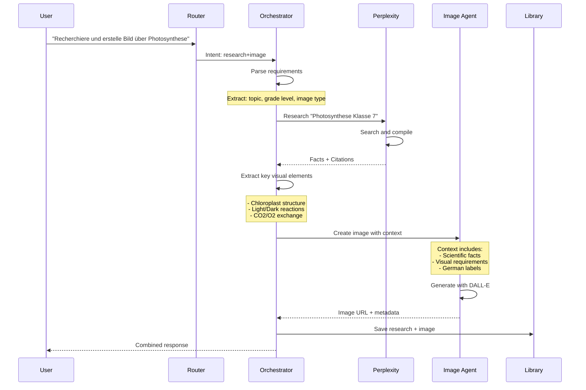
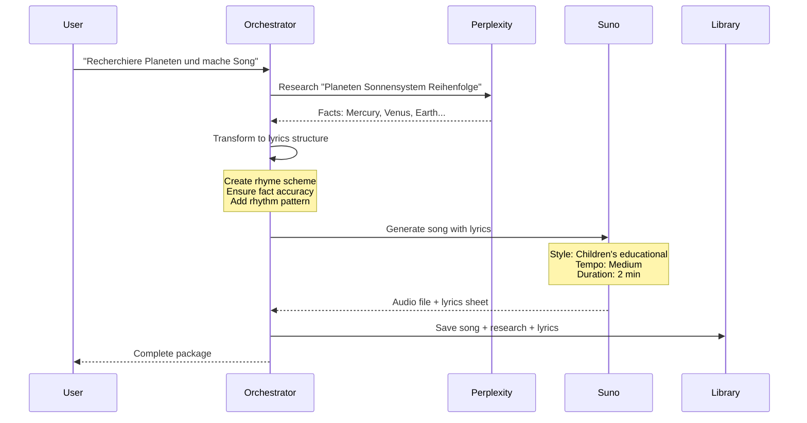
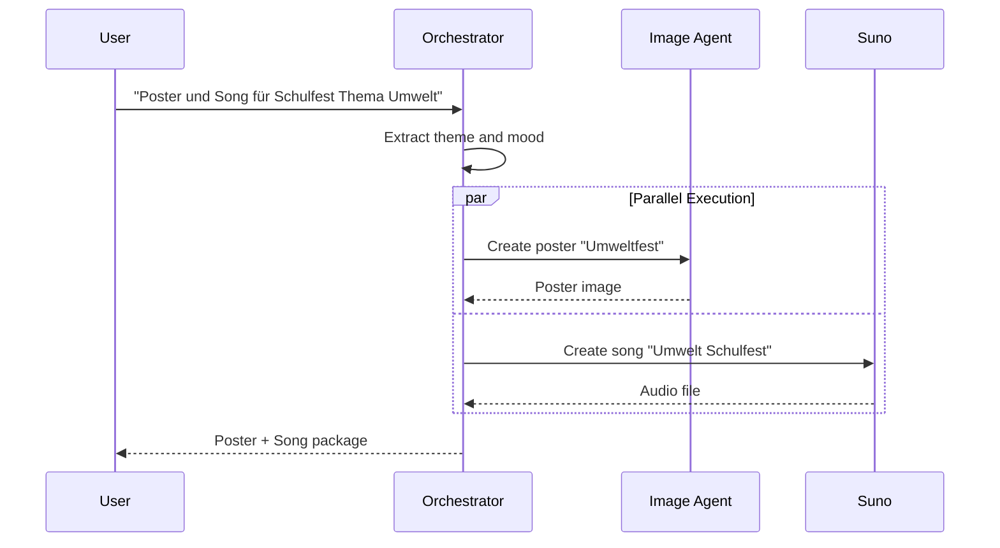
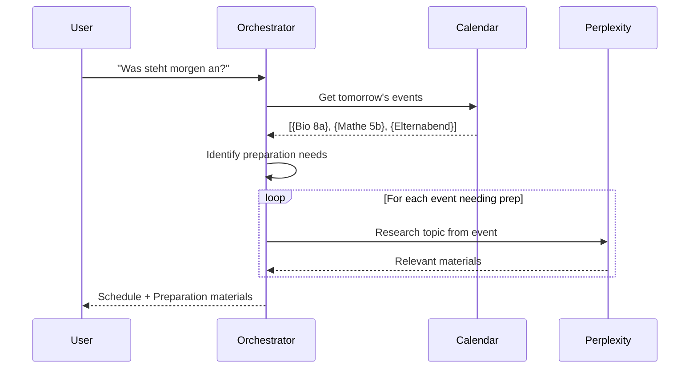
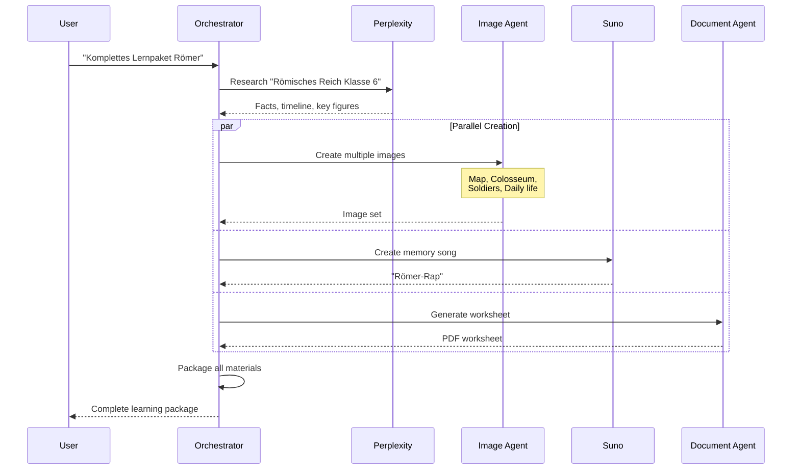

# Detailed Multi-Agent Workflow Specifications

**Created**: 2025-10-20
**Purpose**: Exact implementation specs for each multi-agent workflow
**Priority Order**: Research+Image first (highest value)

---

## Workflow 1: Research + Image (HIGHEST PRIORITY)

### Use Case
Teacher needs factually accurate educational images with correct details.

### Example Inputs
- "Recherchiere und erstelle ein Bild über den Wasserkreislauf"
- "Erkläre Photosynthese und zeige es als Diagramm"
- "Was ist die Französische Revolution? Erstelle eine Infografik"

### Detailed Flow



### Context Transformation

```typescript
interface ResearchToImageContext {
  // From Research Agent
  research: {
    keyFacts: string[];        // ["Photosynthese findet in Chloroplasten statt"]
    visualElements: string[];   // ["Chloroplast", "Sonnenlicht", "CO2", "O2"]
    scientificTerms: {         // For accurate labeling
      german: string;
      description: string;
    }[];
    ageAppropriateness: string; // "7. Klasse - vereinfacht"
  };

  // For Image Agent
  imagePrompt: {
    style: "educational_diagram" | "infographic" | "illustration";
    mustInclude: string[];      // Critical elements from research
    labels: {                   // German labels for diagram
      text: string;
      position?: string;
    }[];
    colorScheme: string;        // "scientific" | "friendly" | "neutral"
    complexity: "simple" | "medium" | "detailed";
  };
}

// Transformation function
function transformResearchToImagePrompt(research: ResearchResult): ImagePrompt {
  const visualElements = extractVisualConcepts(research.facts);
  const labels = extractGermanLabels(research.terms);

  return {
    basePrompt: `Educational diagram showing ${research.topic}`,
    requirements: [
      `Include: ${visualElements.join(', ')}`,
      `German labels: ${labels.join(', ')}`,
      `Style: Clear, scientific, age-appropriate for ${research.gradeLevel}`,
      `Accurate representation based on: ${research.keyFacts[0]}`
    ],
    avoidList: research.commonMisconceptions
  };
}
```

### Error Handling

```typescript
async function executeResearchImageWorkflow(input: string) {
  try {
    // Step 1: Research with retry
    const research = await retry(
      () => perplexityAgent.search(input),
      { retries: 2, fallback: basicWebSearch }
    );

    if (!research.facts || research.facts.length === 0) {
      // Fallback: Create generic educational image
      return imageAgent.create({
        prompt: input,
        style: 'educational',
        warning: 'Recherche nicht erfolgreich - generisches Bild erstellt'
      });
    }

    // Step 2: Generate image with research context
    const imageResult = await imageAgent.create({
      prompt: transformResearchToImagePrompt(research),
      context: research
    });

    if (!imageResult.success) {
      // Return research only
      return {
        research,
        warning: 'Bild konnte nicht erstellt werden',
        suggestion: 'Versuchen Sie es mit einer einfacheren Beschreibung'
      };
    }

    return { research, image: imageResult };

  } catch (error) {
    return handleWorkflowError(error);
  }
}
```

### Success Metrics
- Research completes in <5 seconds
- Image generation in <15 seconds
- Total workflow <20 seconds
- Factual accuracy: 95%+ (based on research)
- User satisfaction: Image matches research

---

## Workflow 2: Research + Music

### Use Case
Create educational songs with factually correct content for memorization.

### Example Inputs
- "Recherchiere die Planeten und mache einen Merkspruch-Song"
- "Erstelle einen Einmaleins-Song für die 7er-Reihe"
- "Mache einen Rap über die Deutsche Geschichte"

### Detailed Flow



### Lyrics Generation from Research

```typescript
interface ResearchToLyrics {
  facts: string[];              // Facts to include
  rhymeScheme: 'AABB' | 'ABAB' | 'ABCB';
  repetitionPattern: {
    chorus: string;             // Main message to repeat
    verses: string[];           // Fact-based verses
  };
  memoryHooks: string[];        // Mnemonics from research
}

function generateEducationalLyrics(research: ResearchResult): LyricsStructure {
  // Example: Planets song
  const facts = research.facts; // ["Mercury closest", "Venus hottest", ...]

  return {
    title: "Die Planeten-Reise",
    chorus: `
      Merkur, Venus, Erde, Mars,
      Jupiter und Saturn - was für ein Spaß!
      Uranus, Neptun ganz weit draußen,
      Acht Planeten, die durchs All sausen!
    `,
    verse1: `
      Merkur ist der Sonne am nächsten dran,
      Klein und schnell, kommt keiner ran.
      Venus strahlt hell in der Nacht,
      Hat eine dicke Wolkenschicht gemacht.
    `,
    educationalNotes: research.keyFacts,
    gradeLevel: research.gradeLevel
  };
}
```

### Suno Integration Parameters

```typescript
interface SunoEducationalRequest {
  lyrics: string;                    // Generated from research
  style: {
    genre: string;                   // User choice or auto
    mood: 'upbeat' | 'calm' | 'energetic';
    tempo: 'slow' | 'medium' | 'fast';
    instruments?: string[];          // Optional specifics
  };
  educational: {
    ageGroup: '6-8' | '9-11' | '12-14' | '15+';
    repetitionCount: number;         // How often to repeat key facts
    language: 'de' | 'en';
  };
  duration: 30 | 120 | 240;          // seconds
}

// Style selection based on content
function selectMusicStyle(topic: string, age: string): MusicStyle {
  const styleMap = {
    'math': { genre: 'pop', mood: 'upbeat', tempo: 'medium' },
    'history': { genre: 'ballad', mood: 'calm', tempo: 'slow' },
    'science': { genre: 'electronic', mood: 'energetic', tempo: 'fast' },
    'language': { genre: 'rap', mood: 'upbeat', tempo: 'fast' }
  };

  return styleMap[detectSubject(topic)] || { genre: 'pop', mood: 'upbeat' };
}
```

---

## Workflow 3: Image + Music

### Use Case
Create matching visual and audio content for events or themes.

### Example Inputs
- "Erstelle Poster und Song für das Schulfest"
- "Mache Geburtstagskarte und Geburtstagslied für die Klasse"
- "Erstelle Motivationsposter mit passendem Song"

### Detailed Flow



### Theme Consistency

```typescript
interface ThemeContext {
  event: string;                    // "Schulfest"
  theme: string;                    // "Umweltschutz"
  mood: string;                     // "fröhlich, motivierend"
  colors: string[];                 // ["grün", "blau", "erdtöne"]
  keywords: string[];               // ["Natur", "Zukunft", "Gemeinsam"]
}

// Ensure consistency across media
function createConsistentMedia(theme: ThemeContext) {
  const imagePrompt = {
    text: `${theme.event} poster with ${theme.theme} theme`,
    style: `colorful, ${theme.mood}`,
    includeText: theme.keywords[0],
    colors: theme.colors
  };

  const songPrompt = {
    lyrics: generateEventLyrics(theme),
    style: matchMoodToMusic(theme.mood),
    duration: 120 // 2 minutes for events
  };

  return { imagePrompt, songPrompt };
}
```

---

## Workflow 4: Calendar + Research

### Use Case
Prepare materials based on upcoming schedule.

### Example Inputs
- "Was steht morgen an und was muss ich vorbereiten?"
- "Recherchiere Themen für nächste Woche"
- "Bereite die Biologiestunde übermorgen vor"

### Detailed Flow



### Smart Preparation Detection

```typescript
interface CalendarEvent {
  title: string;                   // "Biologie 8a"
  time: Date;
  type: 'lesson' | 'meeting' | 'event';
  metadata?: {
    subject?: string;
    grade?: string;
    topic?: string;                // From previous lessons
  };
}

function identifyPreparationNeeds(events: CalendarEvent[]): PrepTask[] {
  return events.map(event => {
    if (event.type === 'lesson') {
      return {
        research: `${event.metadata.subject} ${event.metadata.grade} aktuelle Themen`,
        materials: suggestMaterialType(event.metadata.subject),
        priority: getTimeUntilEvent(event.time)
      };
    }

    if (event.type === 'meeting') {
      return {
        research: 'Talking points für Elternabend',
        materials: 'agenda_template',
        priority: 'high'
      };
    }
  });
}
```

---

## Workflow 5: Complete Learning Package (3+ Agents)

### Use Case
Create comprehensive educational materials for a topic.

### Example Inputs
- "Erstelle komplettes Lernpaket über Römer"
- "Alle Materialien für Geometrie-Einheit"
- "Unterrichtsstunde Klimawandel mit allem"

### Detailed Flow



### Package Components

```typescript
interface LearningPackage {
  topic: string;
  gradeLevel: string;
  components: {
    research: {
      summary: string;
      keyFacts: string[];
      citations: Citation[];
    };
    visuals: {
      images: ImageAsset[];         // 3-5 images
      diagrams: ImageAsset[];        // 1-2 diagrams
      maps?: ImageAsset[];
    };
    audio: {
      song?: AudioAsset;
      pronunciation?: AudioAsset[];  // For languages
    };
    documents: {
      worksheet: PDFAsset;
      teacherNotes: PDFAsset;
      homework?: PDFAsset;
    };
    interactive: {
      quiz: QuizData;
      discussionQuestions: string[];
    };
  };
  metadata: {
    createdAt: Date;
    estimatedDuration: number;      // minutes
    learningObjectives: string[];
    curriculumAlignment: string[];
  };
}

// Orchestration strategy
async function createLearningPackage(topic: string, grade: string) {
  // Phase 1: Research (must be first)
  const research = await perplexityAgent.search({
    query: `${topic} ${grade} Lehrplan Deutschland`,
    depth: 'comprehensive'
  });

  // Phase 2: Parallel creation based on research
  const [images, song, worksheet] = await Promise.all([
    createEducationalImages(research, 4),  // 4 images
    createMemorySong(research),
    generateWorksheet(research)
  ]);

  // Phase 3: Package and validate
  return packageLearningMaterials({
    research,
    images,
    song,
    worksheet
  });
}
```

---

## Orchestration Engine Core

### Main Orchestrator Service

```typescript
class MultiAgentOrchestrator {
  private agents: Map<string, Agent>;
  private workflows: Map<string, WorkflowDefinition>;

  async execute(input: string): Promise<WorkflowResult> {
    // 1. Identify workflow type
    const workflow = this.identifyWorkflow(input);

    // 2. Parse requirements
    const requirements = this.parseRequirements(input, workflow);

    // 3. Create execution plan
    const plan = this.createExecutionPlan(workflow, requirements);

    // 4. Execute plan (parallel where possible)
    const results = await this.executePlan(plan);

    // 5. Synthesize results
    return this.synthesizeResults(results, workflow.outputFormat);
  }

  private async executePlan(plan: ExecutionPlan): Promise<AgentResults[]> {
    const results: AgentResults[] = [];

    for (const phase of plan.phases) {
      if (phase.parallel) {
        // Execute agents in parallel
        const phaseResults = await Promise.all(
          phase.tasks.map(task => this.executeTask(task))
        );
        results.push(...phaseResults);
      } else {
        // Execute sequentially
        for (const task of phase.tasks) {
          const result = await this.executeTask(task);
          results.push(result);
          // Pass context to next task
          this.updateContext(task.outputContext, result);
        }
      }
    }

    return results;
  }
}
```

### Workflow Detection

```typescript
function detectWorkflow(input: string): WorkflowType {
  const patterns = {
    'research_image': /recherch.*erstell.*bild|erkläre.*zeige/i,
    'research_music': /recherch.*song|lied.*über|rap.*thema/i,
    'image_music': /poster.*song|bild.*lied|grafik.*musik/i,
    'calendar_research': /morgen.*vorbereite|woche.*plan/i,
    'complete_package': /komplett.*paket|alle.*material|vollständig/i
  };

  for (const [workflow, pattern] of Object.entries(patterns)) {
    if (pattern.test(input)) {
      return workflow as WorkflowType;
    }
  }

  // Default to single agent
  return detectSingleAgent(input);
}
```

### Context Sharing Protocol

```typescript
interface AgentContext {
  // Shared across all agents
  global: {
    user: string;
    gradeLevel: string;
    subject: string;
    language: 'de' | 'en';
  };

  // Agent-specific contexts
  research?: {
    facts: string[];
    sources: Citation[];
    keywords: string[];
  };

  images?: {
    urls: string[];
    descriptions: string[];
  };

  calendar?: {
    events: CalendarEvent[];
    deadlines: Date[];
  };
}

// Context passing between agents
function passContext(
  from: AgentType,
  to: AgentType,
  context: AgentContext
): AgentContext {
  const contextMap = {
    'research->image': (ctx) => ({
      ...ctx,
      imageRequirements: extractVisualElements(ctx.research.facts)
    }),
    'research->music': (ctx) => ({
      ...ctx,
      lyrics: generateLyricsFromFacts(ctx.research.facts)
    }),
    'calendar->research': (ctx) => ({
      ...ctx,
      topics: extractTopicsFromEvents(ctx.calendar.events)
    })
  };

  const key = `${from}->${to}`;
  return contextMap[key] ? contextMap[key](context) : context;
}
```

---

## Cost Management

### Pre-execution Cost Estimation

```typescript
interface CostEstimate {
  total: number;
  breakdown: {
    agent: string;
    cost: number;
    operations: number;
  }[];
  warning?: string;
}

function estimateWorkflowCost(workflow: WorkflowType): CostEstimate {
  const costs = {
    'research': 0.02,
    'image_create': 0.04,
    'image_edit': 0.039,
    'music': 0.006,
    'maps': 0.025
  };

  const workflowCosts = {
    'research_image': costs.research + costs.image_create,      // $0.06
    'research_music': costs.research + costs.music,             // $0.026
    'complete_package': costs.research + (costs.image_create * 3) + costs.music, // $0.146
  };

  const estimate = workflowCosts[workflow];

  return {
    total: estimate,
    breakdown: getBreakdown(workflow),
    warning: estimate > 0.10 ? 'This workflow costs more than $0.10' : undefined
  };
}
```

---

## Error Recovery Strategies

### Graceful Degradation

```typescript
interface WorkflowRecovery {
  strategy: 'retry' | 'fallback' | 'partial' | 'abort';
  fallbackAgent?: string;
  partialResults?: any[];
  userNotification: string;
}

function handleAgentFailure(
  agent: string,
  error: Error,
  workflow: WorkflowType
): WorkflowRecovery {
  // Critical agent failures
  if (workflow === 'research_image' && agent === 'research') {
    return {
      strategy: 'fallback',
      fallbackAgent: 'basic_search',
      userNotification: 'Verwende alternative Suche...'
    };
  }

  // Non-critical failures - continue with partial results
  if (workflow === 'complete_package' && agent === 'music') {
    return {
      strategy: 'partial',
      partialResults: ['research', 'images', 'documents'],
      userNotification: 'Song konnte nicht erstellt werden, andere Materialien verfügbar'
    };
  }

  // Retry for transient failures
  if (error.message.includes('timeout')) {
    return {
      strategy: 'retry',
      userNotification: 'Versuche erneut...'
    };
  }

  // Default: abort with explanation
  return {
    strategy: 'abort',
    userNotification: `Fehler in ${agent}: ${error.message}`
  };
}
```

---

## Implementation Priority

1. **Week 1**: Research + Image workflow
2. **Week 2**: Research + Music workflow
3. **Week 3**: Orchestration engine improvements
4. **Week 4**: Complete package workflow
5. **Future**: Complex 4+ agent workflows

---

**Note**: Each workflow should be tested with at least 20 real teacher inputs before production deployment.