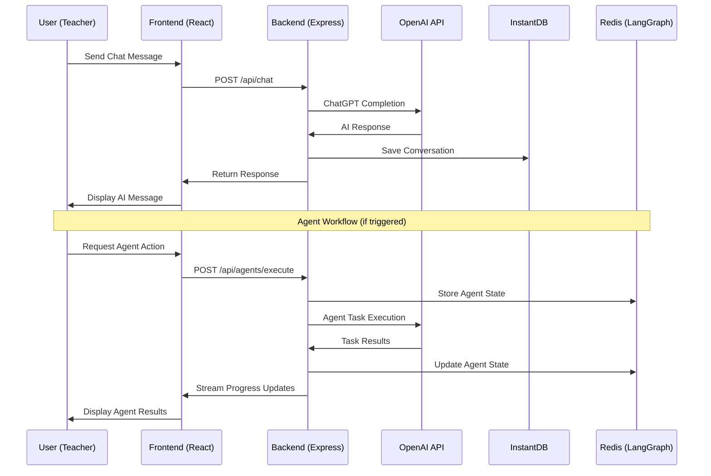
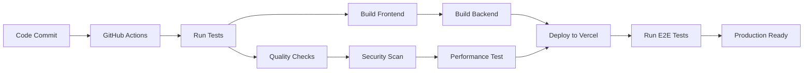

# System Architecture Overview - Lehrkräfte-Assistent

## 📋 Übersicht

**Version**: 2.0 - Production Ready mit LangGraph Agent System
**Letzte Aktualisierung**: 2025-09-29
**Architektur-Typ**: Modern Full-Stack mit AI Integration
**Deployment-Modell**: Serverless + Container Hybrid

---

## 🏗️ HIGH-LEVEL ARCHITECTURE

```
┌─────────────────────────────────────────────────────────────────┐
│                    PRODUCTION SYSTEM                            │
├─────────────────────────────────────────────────────────────────┤
│                                                                 │
│  ┌─────────────────┐    ┌─────────────────┐    ┌──────────────┐ │
│  │   FRONTEND      │    │    BACKEND      │    │  AI SERVICES │ │
│  │                 │    │                 │    │              │ │
│  │ React 19        │◄──►│ Express + TS    │◄──►│ OpenAI GPT-4 │ │
│  │ TypeScript      │    │ Serverless      │    │ DALL-E 3     │ │
│  │ Tailwind CSS    │    │ Functions       │    │ Files API    │ │
│  │ Vite Build      │    │                 │    │              │ │
│  └─────────────────┘    └─────────────────┘    └──────────────┘ │
│           │                       │                       │     │
│           ▼                       ▼                       ▼     │
│  ┌─────────────────┐    ┌─────────────────┐    ┌──────────────┐ │
│  │  InstantDB      │    │ LangGraph       │    │  External    │ │
│  │                 │    │ Agent System    │    │  Services    │ │
│  │ Authentication  │    │                 │    │              │ │
│  │ Real-time Data  │    │ Redis Storage   │    │ Vercel CDN   │ │
│  │ User Management │    │ Workflow Engine │    │ GitHub CI/CD │ │
│  └─────────────────┘    └─────────────────┘    └──────────────┘ │
│                                                                 │
└─────────────────────────────────────────────────────────────────┘
```

## 🎯 CORE SYSTEM COMPONENTS

### Frontend Architecture (React + TypeScript)
```
teacher-assistant/frontend/
├── src/
│   ├── components/          # Reusable UI Components
│   │   ├── ChatView.tsx     # Real-time Chat Interface
│   │   ├── LibraryView.tsx  # Chat History & Artifacts
│   │   ├── ProfileView.tsx  # Teacher Knowledge Dashboard
│   │   └── AgentProgress/   # LangGraph Agent UI Components
│   ├── pages/              # Page-Level Components
│   │   ├── Home/           # Dashboard & Recent Activity
│   │   ├── Chat/           # Current Session Management
│   │   └── Library/        # Historical Content
│   ├── hooks/              # Custom React Hooks
│   │   ├── useChat.ts      # ChatGPT Integration Hook
│   │   ├── useAgents.ts    # LangGraph Agent Management
│   │   └── useAuth.ts      # InstantDB Authentication
│   ├── lib/                # Core Utilities
│   │   ├── api.ts          # HTTP Client with Error Handling
│   │   ├── instantdb.ts    # Database Configuration
│   │   └── types.ts        # TypeScript Definitions
│   └── test/               # Comprehensive Test Suite
```

### Backend Architecture (Express + Serverless)
```
teacher-assistant/backend/
├── src/
│   ├── routes/             # API Endpoint Definitions
│   │   ├── chat.ts         # ChatGPT Integration Endpoints
│   │   ├── files.ts        # File Upload & Processing
│   │   ├── agents.ts       # LangGraph Agent Execution
│   │   └── data.ts         # InstantDB Data Operations
│   ├── services/           # Business Logic Layer
│   │   ├── chatService.ts  # OpenAI GPT Integration
│   │   ├── fileService.ts  # File Processing & Validation
│   │   ├── agentService.ts # LangGraph Workflow Management
│   │   └── instantdbService.ts # Database Operations
│   ├── agents/             # LangGraph Agent Definitions
│   │   ├── imageAgent.ts   # DALL-E Image Generation
│   │   ├── searchAgent.ts  # Web Search Integration
│   │   └── documentAgent.ts # Document Processing
│   ├── config/             # System Configuration
│   │   ├── openai.ts       # OpenAI Client Setup
│   │   ├── redis.ts        # Redis Checkpoint Storage
│   │   └── index.ts        # Environment Management
│   └── middleware/         # Request Processing
│       ├── validation.ts   # Input Validation & Sanitization
│       ├── rateLimiter.ts  # API Rate Limiting
│       └── auth.ts         # Authentication Middleware
```

---

## 🔧 TECHNOLOGY STACK DETAILED

### Frontend Technology Stack
| Component | Technology | Version | Purpose |
|-----------|------------|---------|---------|
| **Framework** | React | 19.x | Modern Component Architecture |
| **Language** | TypeScript | 5.x | Type Safety & Developer Experience |
| **Build Tool** | Vite | 6.x | Fast Development & Optimized Builds |
| **Styling** | Tailwind CSS | 4.x | Utility-First Responsive Design |
| **Routing** | React Router | 7.x | Client-Side Navigation |
| **State Management** | React Context + Hooks | Native | Lightweight State Management |
| **HTTP Client** | Fetch API + Custom Wrapper | Native | API Communication |
| **Testing** | Vitest + React Testing Library | Latest | Component & Hook Testing |

### Backend Technology Stack
| Component | Technology | Version | Purpose |
|-----------|------------|---------|---------|
| **Runtime** | Node.js | 18.x | JavaScript Server Runtime |
| **Framework** | Express | 4.x | Web Application Framework |
| **Language** | TypeScript | 5.x | Type Safety & Code Quality |
| **Deployment** | Vercel Serverless Functions | Latest | Scalable Serverless Architecture |
| **AI Integration** | OpenAI SDK | 5.23.0 | ChatGPT, DALL-E, Files API |
| **Agent Framework** | LangGraph | 0.4.9 | AI Agent Orchestration |
| **Database** | InstantDB | Latest | Real-time Database & Auth |
| **Caching** | Redis | 7.x | Agent State Persistence |
| **Testing** | Jest + Supertest | Latest | API & Integration Testing |

### Infrastructure & DevOps
| Component | Technology | Purpose |
|-----------|------------|---------|
| **Hosting** | Vercel | Frontend & Serverless Backend |
| **CDN** | Vercel Edge Network | Global Content Delivery |
| **CI/CD** | GitHub Actions | Automated Testing & Deployment |
| **Monitoring** | Vercel Analytics | Performance & Error Tracking |
| **Security** | ESLint + npm audit | Code Quality & Vulnerability Scanning |

---

## 🌐 NETWORK ARCHITECTURE

### API Endpoint Structure
```
Production API Base: https://eduhu-pwa-prototype.vercel.app/api
Development API Base: http://localhost:3003/api

Core Endpoints:
├── /chat                   # ChatGPT Integration
│   ├── POST /chat          # Send message to ChatGPT
│   ├── GET /chat/health    # OpenAI connection status
│   └── GET /chat/models    # Available AI models
├── /files                  # File Upload & Processing
│   ├── POST /files/upload  # Upload & process files
│   └── GET /files/{id}     # Retrieve file metadata
├── /agents                 # LangGraph Agent System
│   ├── POST /agents/execute # Execute agent workflow
│   ├── GET /agents/status  # Agent execution status
│   └── GET /agents/types   # Available agent types
├── /data                   # InstantDB Operations
│   ├── GET /data/profile   # Teacher profile data
│   ├── POST /data/context  # Save context information
│   └── GET /data/history   # Chat history retrieval
└── /health                 # System Health Checks
    ├── GET /health         # Overall system status
    └── GET /health/deep    # Comprehensive health check
```

### Request/Response Flow


---

## 🔐 SECURITY ARCHITECTURE

### Authentication & Authorization
```
Authentication Flow:
1. User enters email address
2. InstantDB sends magic link to email
3. User clicks link and enters verification code
4. InstantDB validates and creates session
5. Frontend receives authenticated user object
6. Subsequent requests include session token
```

### API Security Layers
| Layer | Implementation | Purpose |
|-------|----------------|---------|
| **Rate Limiting** | Express Rate Limit | Prevent API abuse (30 req/15min) |
| **Input Validation** | Joi + Custom Validators | Sanitize and validate requests |
| **File Security** | Multer + File Type Validation | Prevent malicious uploads |
| **CORS** | Configured Origins | Control cross-origin access |
| **Environment Variables** | Secure Secret Management | Protect API keys and tokens |
| **Error Handling** | Sanitized Error Messages | Prevent information leakage |

### Data Protection
- **In Transit**: HTTPS/TLS 1.3 encryption for all communications
- **At Rest**: InstantDB encrypted storage for user data
- **API Keys**: Environment variable isolation with rotation capability
- **File Uploads**: Validated file types, size limits, and secure storage
- **User Sessions**: Secure token-based authentication with expiry

---

## 🤖 AI INTEGRATION ARCHITECTURE

### OpenAI Services Integration
```
OpenAI Integration Stack:
├── GPT-4o-mini                 # Primary Chat Model
│   ├── Model: gpt-4o-mini      # Cost-effective, high-quality
│   ├── Temperature: 0.7        # Balanced creativity/consistency
│   ├── Max Tokens: 1500        # Comprehensive responses
│   └── System Prompt: German Teacher Assistant Context
├── DALL-E 3                    # Image Generation
│   ├── Size: 1024x1024         # High-quality images
│   ├── Quality: standard       # Cost-optimized
│   └── Style: vivid            # Educational content
├── Files API                   # Document Processing
│   ├── Supported: PDF, DOCX, TXT, Images
│   ├── Max Size: 10MB per file
│   └── Processing: OCR + Content extraction
└── Vision API                  # Image Analysis
    ├── Model: gpt-4-vision-preview
    ├── Max Images: 4 per request
    └── Analysis: Educational content recognition
```

### LangGraph Agent System
```
Agent Architecture:
├── Agent Orchestration          # LangGraph Framework
│   ├── Workflow Engine          # Multi-step task execution
│   ├── State Management         # Redis-based persistence
│   ├── Error Recovery           # Retry + fallback mechanisms
│   └── Progress Streaming       # Real-time status updates
├── Image Generation Agent       # DALL-E Integration
│   ├── Usage Limits: 10/month   # Cost control
│   ├── Quality Scoring: Automated
│   ├── Prompt Enhancement: Educational context
│   └── Error Handling: Credit preservation
├── Search Agent (Planned)       # Web Search Integration
│   ├── Provider: Tavily API    # Educational content focus
│   ├── Usage: Unlimited        # No cost restrictions
│   └── Content Filtering: Age-appropriate
└── Document Agent (Planned)     # Document Generation
    ├── Formats: PDF, DOCX, HTML
    ├── Templates: Educational layouts
    └── Content: Lesson plans, worksheets
```

---

## 📊 DATA ARCHITECTURE

### InstantDB Schema Design
```typescript
// Core Data Models
interface TeacherProfile {
  id: string;
  email: string;
  name?: string;
  subjects: string[];
  gradeLevel: string[];
  schoolType: string;
  experience: number;
  preferences: {
    language: 'de' | 'en';
    aiPersonality: 'formal' | 'friendly' | 'enthusiastic';
    responseLength: 'concise' | 'detailed' | 'comprehensive';
  };
  createdAt: Date;
  updatedAt: Date;
}

interface ChatSession {
  id: string;
  teacherId: string;
  title: string;
  messages: Message[];
  context: {
    subject?: string;
    gradeLevel?: string;
    topic?: string;
  };
  createdAt: Date;
  lastActivity: Date;
}

interface Message {
  id: string;
  sessionId: string;
  role: 'user' | 'assistant' | 'system';
  content: string;
  files?: UploadedFile[];
  agentData?: AgentExecution;
  timestamp: Date;
}

interface AgentExecution {
  id: string;
  type: 'image_generation' | 'web_search' | 'document_creation';
  status: 'pending' | 'running' | 'completed' | 'failed';
  input: any;
  output: any;
  progress: number;
  error?: string;
  createdAt: Date;
  completedAt?: Date;
}
```

### Redis State Management
```
LangGraph State Storage:
├── Agent Checkpoints           # Workflow state persistence
│   ├── Key Pattern: agent:{id}:checkpoint:{step}
│   ├── TTL: 24 hours          # Automatic cleanup
│   └── Compression: JSON + gzip
├── Progress Tracking          # Real-time status updates
│   ├── Key Pattern: progress:{executionId}
│   ├── TTL: 1 hour           # Short-term caching
│   └── Structure: {step, total, message, data}
└── Usage Tracking            # Rate limiting and quotas
    ├── Key Pattern: usage:{userId}:{agentType}:{period}
    ├── TTL: 30 days          # Monthly reset
    └── Structure: {count, limit, resetDate}
```

---

## 🚀 DEPLOYMENT ARCHITECTURE

### Vercel Serverless Deployment
```
Production Deployment:
├── Frontend (React SPA)
│   ├── Build: Vite Static Generation
│   ├── CDN: Vercel Edge Network
│   ├── Caching: Aggressive static asset caching
│   └── Routing: Client-side with fallback
├── Backend (Serverless Functions)
│   ├── Runtime: Node.js 18.x
│   ├── Architecture: Individual function per endpoint
│   ├── Cold Start: Optimized with connection pooling
│   └── Scaling: Automatic based on demand
├── Database (InstantDB)
│   ├── Location: Global distributed
│   ├── Replication: Multi-region
│   ├── Backup: Automatic point-in-time recovery
│   └── Scaling: Automatic based on usage
└── Caching (Redis)
    ├── Provider: Redis Cloud / Upstash
    ├── Configuration: Persistence enabled
    ├── Memory: 1GB with eviction policies
    └── Networking: VPC private connections
```

### Environment Configuration
```yaml
# Production Environment Variables
OPENAI_API_KEY: sk-proj-*** # OpenAI API access
INSTANTDB_APP_ID: 39f14e13-*** # Database connection
REDIS_URL: redis://*** # Agent state storage
NODE_ENV: production # Runtime configuration
RATE_LIMIT_MAX: 30 # Requests per window
RATE_LIMIT_WINDOW: 900000 # 15 minutes in ms
MAX_FILE_SIZE: 10485760 # 10MB in bytes
ALLOWED_ORIGINS: https://eduhu-pwa-prototype.vercel.app
```

---

## 📈 PERFORMANCE ARCHITECTURE

### Frontend Performance Optimizations
- **Code Splitting**: Dynamic imports for route-based chunks
- **Tree Shaking**: Unused code elimination in build process
- **Asset Optimization**: Image compression and WebP format
- **Caching Strategy**: Service worker for offline capabilities
- **Bundle Analysis**: Regular bundle size monitoring and optimization

### Backend Performance Optimizations
- **Connection Pooling**: Reuse database connections across requests
- **Response Caching**: Cache frequently requested data with TTL
- **Compression**: Gzip compression for all API responses
- **Request Optimization**: Minimize external API calls with batching
- **Cold Start Mitigation**: Optimized function initialization

### Database Performance
- **Query Optimization**: Efficient InstantDB query patterns
- **Indexing Strategy**: Optimized indices for common queries
- **Connection Management**: Proper connection lifecycle management
- **Caching Layer**: Redis caching for frequently accessed data

---

## 🔄 SCALABILITY CONSIDERATIONS

### Horizontal Scaling Capabilities
- **Serverless Functions**: Automatic scaling based on demand
- **CDN Distribution**: Global edge network for content delivery
- **Database Scaling**: InstantDB automatic scaling and replication
- **State Management**: Redis clustering for high availability

### Performance Monitoring
- **Real User Monitoring**: Vercel Analytics for actual user metrics
- **API Performance**: Response time and error rate tracking
- **Resource Usage**: Memory and CPU utilization monitoring
- **Cost Optimization**: Usage-based scaling with cost controls

### Future Scaling Plans
- **Microservices**: Potential service separation for specialized functions
- **Multi-Region**: Geographic distribution for reduced latency
- **Load Balancing**: Advanced routing and traffic distribution
- **Caching Layers**: Multi-tier caching strategy implementation

---

## 🛠️ DEVELOPMENT ARCHITECTURE

### Development Environment
```
Local Development Stack:
├── Frontend: http://localhost:5173 (Vite Dev Server)
├── Backend: http://localhost:3003 (Express Dev Server)
├── Database: InstantDB Cloud (Shared dev instance)
├── Redis: Local Redis instance or Redis Cloud
└── AI Services: OpenAI API (Development API key)
```

### Build & Deployment Pipeline


### Code Quality Architecture
- **TypeScript Strict Mode**: Zero tolerance for type errors
- **ESLint Configuration**: Comprehensive linting rules
- **Prettier Integration**: Automatic code formatting
- **Pre-commit Hooks**: Quality checks before commits
- **Automated Testing**: Comprehensive test coverage requirement

---

**Document Maintained By**: Architecture Team & System Architects
**Review Schedule**: Monthly architecture reviews, quarterly strategic updates
**Related Documents**: API Documentation, Deployment Guide, Testing Strategy