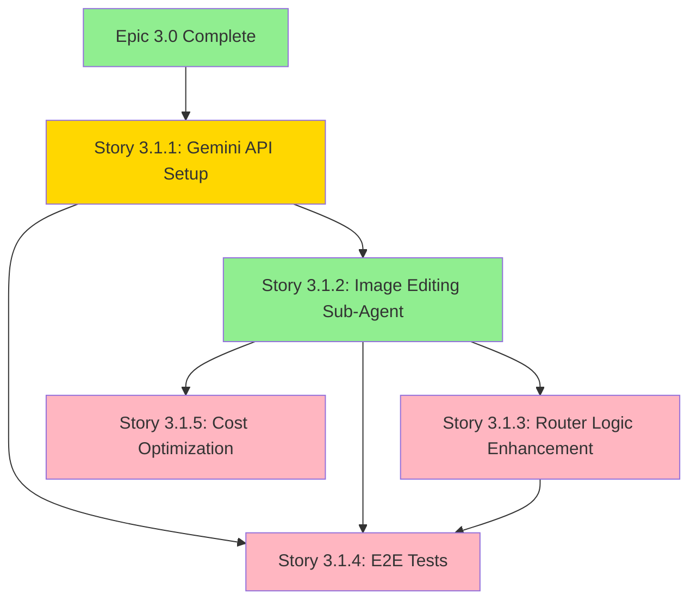

# Epic 3.1 Sprint Planning Report

**Date**: 2025-10-21
**Epic**: Epic 3.1 - Image Agent: Creation + Editing
**Analyst**: BMad Scrum Master (SM Agent)
**Purpose**: Comprehensive readiness assessment and sprint planning for Epic 3.1
**Prerequisites**: Epic 3.0 completion (80% complete, Story 3.0.5 remaining)

---

## Executive Summary

**Epic 3.1 Readiness**: ⚠️ **PARTIALLY READY** (1 of 5 stories documented)

**Recommendation**:
1. **Complete Story 3.0.5 FIRST** (Epic 3.0 final story)
2. **Create missing Epic 3.1 stories** (Stories 3.1.1, 3.1.3, 3.1.4, 3.1.5)
3. **Start Epic 3.1.1** immediately after Epic 3.0 completion
4. **Estimated Epic 3.1 Duration**: 3-4 weeks (15-20 days)

---

## 1. Story Files Discovery

### Files Found ✅
```
✅ docs/epics/epic-3.1.md (Epic overview)
✅ docs/stories/epic-3.1.story-2-updated.md (Story 3.1.2 - Image Editing Sub-Agent)
✅ docs/development-logs/story-3.1.1-coderabbit-pilot-plan.md (Story 3.1.1 implementation plan)
```

### Files Missing ❌
```
❌ docs/stories/epic-3.1.story-1.md (Story 3.1.1 - Gemini API Integration)
❌ docs/stories/epic-3.1.story-3.md (Story 3.1.3 - Router Logic)
❌ docs/stories/epic-3.1.story-4.md (Story 3.1.4 - E2E Tests)
❌ docs/stories/epic-3.1.story-5.md (Story 3.1.5 - Cost Optimization)
```

**Gap Analysis**: 4 of 5 stories need to be created before Epic 3.1 can start

---

## 2. Story Readiness Matrix

| Story ID | Title | Status | Completeness | Dependencies | Risk Level |
|----------|-------|--------|--------------|--------------|------------|
| **3.1.1** | Google AI Studio Setup + Gemini API Integration | ⚠️ **NEEDS WORK** | 50% (plan exists, story file missing) | Epic 3.0 complete | 🟡 MEDIUM |
| **3.1.2** | Image Editing Sub-Agent | ✅ **READY** | 100% (comprehensive story file) | Story 3.1.1 | 🟡 MEDIUM |
| **3.1.3** | Router Logic - Creation vs. Editing Detection | ❌ **MISSING** | 0% (no story file) | Story 3.1.2 | 🟡 MEDIUM |
| **3.1.4** | Image Workflow E2E Tests | ❌ **MISSING** | 0% (no story file) | Stories 3.1.1, 3.1.2, 3.1.3 | 🟢 LOW |
| **3.1.5** | Cost Optimization (Gemini Free Tier) | ❌ **MISSING** | 0% (no story file) | Story 3.1.2 | 🟢 LOW |

### Readiness Score: 20% (1 of 5 ready)

---

## 3. Dependency Graph



**Legend**:
- 🟢 Green: Ready
- 🟡 Yellow: Partially Ready
- 🔴 Pink: Missing

### Dependency Details

**Story 3.1.1** (Gemini API Setup):
- **Depends On**: Epic 3.0 completion (Story 3.0.5)
- **Blocks**: Stories 3.1.2, 3.1.4
- **Critical Path**: YES (foundation story)

**Story 3.1.2** (Image Editing Sub-Agent):
- **Depends On**: Story 3.1.1 (Gemini API working)
- **Blocks**: Stories 3.1.3, 3.1.4, 3.1.5
- **Critical Path**: YES (core feature)

**Story 3.1.3** (Router Logic):
- **Depends On**: Story 3.1.2 (editing capability exists)
- **Blocks**: Story 3.1.4 (E2E tests need router)
- **Critical Path**: YES (user experience)

**Story 3.1.4** (E2E Tests):
- **Depends On**: Stories 3.1.1, 3.1.2, 3.1.3 (all features implemented)
- **Blocks**: Epic 3.1 completion
- **Critical Path**: YES (quality gate)

**Story 3.1.5** (Cost Optimization):
- **Depends On**: Story 3.1.2 (usage tracking needed)
- **Blocks**: Production deployment confidence
- **Critical Path**: NO (can be done in parallel with 3.1.3/3.1.4)

---

## 4. Risk Assessment

### Story 3.1.1: Gemini API Integration
**Risk Level**: 🟡 **MEDIUM**

**Risks**:
1. **External Dependency**: Google AI Studio account setup may have delays
2. **API Complexity**: First time integrating Gemini (learning curve)
3. **Rate Limits**: Free tier constraints (100 images/day)

**Mitigation**:
- Create Google AI Studio account BEFORE story starts
- Use Story 3.1.1 as CodeRabbit pilot (extra QA layer)
- Test rate limiting early with integration tests

**Estimated Time**: 1-2 days (8-16 hours)

---

### Story 3.1.2: Image Editing Sub-Agent
**Risk Level**: 🟡 **MEDIUM**

**Risks**:
1. **Complexity**: Edit modal UI + Gemini integration + version management
2. **Performance**: 10-second requirement for image editing
3. **Natural Language**: German instruction parsing accuracy

**Mitigation**:
- Story file is comprehensive with clear ACs
- Gemini 2.5 Flash is fast (optimized for speed)
- Test German instructions with diverse dataset

**Estimated Time**: 3-5 days (24-40 hours)

---

### Story 3.1.3: Router Logic Enhancement
**Risk Level**: 🟡 **MEDIUM**

**Risks**:
1. **Classification Accuracy**: ≥95% accuracy required for creation vs editing
2. **Context Understanding**: Must detect image references in German
3. **Regression Risk**: Router already working, changes could break it

**Mitigation**:
- Build on existing router from Epic 3.0 (proven foundation)
- Comprehensive test dataset (≥100 samples)
- Existing E2E tests catch regressions

**Estimated Time**: 2-3 days (16-24 hours)

---

### Story 3.1.4: E2E Tests
**Risk Level**: 🟢 **LOW**

**Risks**:
1. **Test Complexity**: Full workflow testing (creation + editing)
2. **Flaky Tests**: Playwright timing issues

**Mitigation**:
- Leverage existing Playwright infrastructure from Epic 3.0
- Use proper async handling (no hard waits)
- Screenshot validation for visual confirmation

**Estimated Time**: 2-3 days (16-24 hours)

---

### Story 3.1.5: Cost Optimization
**Risk Level**: 🟢 **LOW**

**Risks**:
1. **Usage Tracking**: Accurate counting of Gemini usage
2. **Limit Enforcement**: Preventing free tier overruns

**Mitigation**:
- Simple counter implementation (InstantDB)
- Daily reset at midnight (timezone handling)
- Fallback to DALL-E when limit reached

**Estimated Time**: 1-2 days (8-16 hours)

---

## 5. Recommended Implementation Order

### Phase 1: Foundation (Week 1)
**Priority**: CRITICAL - Must complete before other stories

1. **Story 3.1.1: Gemini API Integration**
   - **Duration**: 1-2 days (8-16 hours)
   - **Why First**: Blocks all other stories
   - **Special**: CodeRabbit pilot story (extra documentation)
   - **Deliverable**: Working Gemini API integration with error handling

### Phase 2: Core Feature (Week 2)
**Priority**: HIGH - Main value delivery

2. **Story 3.1.2: Image Editing Sub-Agent**
   - **Duration**: 3-5 days (24-40 hours)
   - **Why Second**: Core feature, dependencies met after 3.1.1
   - **Complexity**: HIGH (UI + API + version management)
   - **Deliverable**: Teachers can edit images with German instructions

### Phase 3: Integration & Optimization (Week 3)
**Priority**: HIGH - User experience + cost control

3. **Story 3.1.3: Router Logic Enhancement**
   - **Duration**: 2-3 days (16-24 hours)
   - **Why Third**: Requires editing capability to exist
   - **Complexity**: MEDIUM (enhancement to existing router)
   - **Deliverable**: Router auto-detects creation vs editing

4. **Story 3.1.5: Cost Optimization** (PARALLEL with 3.1.3)
   - **Duration**: 1-2 days (8-16 hours)
   - **Why Parallel**: Independent of router logic
   - **Complexity**: LOW (usage tracking)
   - **Deliverable**: 20 images/day limit enforced

### Phase 4: Quality Assurance (Week 4)
**Priority**: CRITICAL - Cannot ship without this

5. **Story 3.1.4: E2E Tests**
   - **Duration**: 2-3 days (16-24 hours)
   - **Why Last**: Tests complete integrated system
   - **Complexity**: MEDIUM (comprehensive testing)
   - **Deliverable**: Full E2E coverage for creation + editing

---

## 6. Sprint Allocation

### Sprint 1: Foundation (Week 5 - Epic 3.1 Start)
**Timeline**: Days 1-7
**Capacity**: 40 hours (1 developer)

| Story | Priority | Estimated Hours | Sprint Allocation |
|-------|----------|----------------|-------------------|
| 3.1.1: Gemini API Setup | P0 | 8-16 hours | **100% in Sprint 1** |

**Sprint 1 Goal**: Complete Gemini API integration and unblock Story 3.1.2

**Deliverables**:
- ✅ Google AI Studio account configured
- ✅ `@google/generative-ai` package installed
- ✅ Gemini API working with test image
- ✅ Error handling and rate limit detection
- ✅ Documentation in `docs/architecture/api-documentation/gemini.md`
- ✅ QA Review: PASS (CodeRabbit + Quinn)

**Buffer**: 24 hours (60%) - First Gemini integration, learning curve expected

---

### Sprint 2: Core Feature (Week 6-7)
**Timeline**: Days 8-21 (2 weeks)
**Capacity**: 80 hours (1 developer, 2 weeks)

| Story | Priority | Estimated Hours | Sprint Allocation |
|-------|----------|----------------|-------------------|
| 3.1.2: Image Editing Sub-Agent | P0 | 24-40 hours | **100% in Sprint 2** |

**Sprint 2 Goal**: Enable teachers to edit images with natural language

**Deliverables**:
- ✅ Edit Modal UI implemented
- ✅ All 6 edit operations working (add, remove, style, colors, background, text)
- ✅ German NLP processing functional
- ✅ Version management (original preserved)
- ✅ Performance <10 seconds
- ✅ E2E tests for editing workflow
- ✅ QA Review: PASS

**Buffer**: 40 hours (50%) - Complex story with UI + API + versioning

---

### Sprint 3: Integration & Testing (Week 8-9)
**Timeline**: Days 22-35 (2 weeks)
**Capacity**: 80 hours (1 developer, 2 weeks)

| Story | Priority | Estimated Hours | Sprint Allocation |
|-------|----------|----------------|-------------------|
| 3.1.3: Router Logic Enhancement | P0 | 16-24 hours | **50% in Sprint 3** |
| 3.1.5: Cost Optimization | P0 | 8-16 hours | **20% in Sprint 3** |
| 3.1.4: E2E Tests | P0 | 16-24 hours | **30% in Sprint 3** |

**Sprint 3 Goal**: Complete Epic 3.1 with router enhancement, cost controls, and comprehensive testing

**Deliverables**:
- ✅ Router detects creation vs editing (≥95% accuracy)
- ✅ Manual override functional
- ✅ 20 images/day limit enforced
- ✅ Usage dashboard tracking Gemini usage
- ✅ Full E2E test suite (creation + editing workflows)
- ✅ Screenshots captured for all test steps
- ✅ QA Review: PASS for all 3 stories
- ✅ Epic 3.1: COMPLETE

**Buffer**: 32 hours (40%) - Testing stories, usually faster than features

---

## 7. Gaps & Required Actions

### Critical Gaps (Must Fix Before Starting)

#### Gap 1: Missing Story Files
**Impact**: BLOCKS Epic 3.1 start
**Action Required**: Create 4 missing story files
**Owner**: BMad SM Agent
**Timeline**: 2-4 hours

**Stories to Create**:
1. `docs/stories/epic-3.1.story-1.md` - Gemini API Integration
2. `docs/stories/epic-3.1.story-3.md` - Router Logic Enhancement
3. `docs/stories/epic-3.1.story-4.md` - E2E Tests
4. `docs/stories/epic-3.1.story-5.md` - Cost Optimization

**Template Source**: Use `epic-3.1.story-2-updated.md` as reference for quality

---

#### Gap 2: Epic 3.0 Not Complete
**Impact**: Story 3.1.1 cannot start
**Action Required**: Complete Story 3.0.5 (Router E2E Tests)
**Owner**: Dev Agent
**Timeline**: 1-2 days

**Current Status**: Story 3.0.5 is "Ready for QA Review" (2025-10-21)
**Next Steps**:
1. Run `/bmad.review docs/stories/epic-3.0.story-5.md`
2. Get QA PASS
3. Mark Epic 3.0 as COMPLETE
4. Celebrate Epic 3.0 completion 🎉

---

#### Gap 3: Google AI Studio Account
**Impact**: Story 3.1.1 cannot start without API key
**Action Required**: Create Google AI Studio account and get API key
**Owner**: User (Steffen)
**Timeline**: 30 minutes

**Steps**:
1. Go to https://aistudio.google.com/
2. Create account with Google credentials
3. Generate API key
4. Add to `.env` as `GOOGLE_AI_API_KEY`
5. Document API key location in story

---

### Non-Critical Gaps (Nice to Have)

#### Gap 4: Risk Assessments Missing
**Impact**: LOW - Can create during development
**Action Required**: Run `/bmad.risk` for each story after story files created
**Owner**: QA Agent (Quinn)
**Timeline**: 1-2 hours total

**Recommended Timing**:
- Story 3.1.1 Risk: Before implementation starts
- Story 3.1.2 Risk: Before implementation starts (complex story)
- Stories 3.1.3-3.1.5: During Sprint 2 (prepare for Sprint 3)

---

#### Gap 5: Test Design Missing
**Impact**: LOW - Can create during development
**Action Required**: Run `/bmad.test-design` for Stories 3.1.1 and 3.1.2
**Owner**: QA Agent (Quinn)
**Timeline**: 1 hour per story

**Recommended Timing**:
- Story 3.1.1 Test Design: Before implementation (CodeRabbit pilot benefits from test plan)
- Story 3.1.2 Test Design: Before implementation (complex story with many test scenarios)

---

## 8. Detailed Story Analysis

### Story 3.1.1: Google AI Studio Setup + Gemini API Integration

**Current State**: ⚠️ PARTIALLY READY
- ✅ Implementation plan exists (`story-3.1.1-coderabbit-pilot-plan.md`)
- ✅ CodeRabbit pilot workflow documented
- ❌ Story file missing (`epic-3.1.story-1.md`)

**Story Overview** (from Epic 3.1):
- Goal: Gemini 2.5 Flash Image API integrated into backend
- Acceptance Criteria:
  1. Google AI Studio account created with API key
  2. `@google/generative-ai` npm package installed
  3. Gemini API successfully edits test image
  4. Error handling for API failures and rate limits
  5. Documentation added to `docs/architecture/api-documentation/gemini.md`

**Additional Context**:
- **Special**: First CodeRabbit pilot story
- **Documentation**: Enhanced session log required (CodeRabbit findings vs Quinn QA)
- **Success Metrics**: CodeRabbit pilot success = >90% valid findings, <10% false positives

**Recommended Tasks** (for story file):
1. Create Google AI Studio account
2. Install `@google/generative-ai` package
3. Create `GeminiImageService` class
4. Implement `editImage()` method
5. Add error handling (network, rate limits, invalid input)
6. Add timeout handling (30 seconds)
7. Write unit tests
8. Write integration tests
9. **Run CodeRabbit review** (pilot)
10. Document CodeRabbit findings in session log
11. Create architecture documentation

**Estimated Time**: 8-16 hours (includes CodeRabbit pilot overhead)

---

### Story 3.1.2: Image Editing Sub-Agent

**Current State**: ✅ READY
- ✅ Comprehensive story file exists
- ✅ All ACs clearly defined
- ✅ Technical implementation detailed
- ✅ Task breakdown complete
- ✅ User specifications integrated (from Steffen)

**Story Highlights**:
- **Complexity**: HIGH (UI + API + version management + NLP)
- **User Value**: HIGH (core Epic 3.1 feature)
- **ACs**: 8 acceptance criteria covering all aspects
- **Features**: 6 edit operations, German NLP, version management, usage tracking

**Key Requirements**:
- Max file size: 20 MB
- Supported formats: PNG, JPEG, WebP, HEIC, HEIF
- Performance: <10 seconds per edit
- Usage limit: 20 images/day (combined with creation)
- Version management: Original ALWAYS preserved, unlimited versions

**Technical Components**:
1. `ImageEditModal.tsx` - UI component
2. `GeminiEditService.ts` - Backend service
3. Router enhancement - Image reference resolution
4. Version management - Metadata tracking
5. Usage tracking - Daily limit counter

**Recommended Approach**:
- Start with UI mockup (get user feedback early)
- Implement backend service first (can test independently)
- Integrate UI + backend
- Add version management
- Add usage tracking
- Comprehensive E2E tests

**Estimated Time**: 24-40 hours (3-5 days)

---

### Story 3.1.3: Router Logic - Creation vs. Editing Detection

**Current State**: ❌ MISSING (story file needed)

**Story Overview** (from Epic 3.1):
- Goal: Router automatically detects creation vs editing intent
- Acceptance Criteria:
  1. Router detects editing keywords: "ändere", "bearbeite", "füge hinzu", "entferne"
  2. Router detects context: uploaded image or reference to previous image
  3. Classification accuracy ≥95% on test dataset
  4. Confidence score displayed to user
  5. Manual override if classification is incorrect

**Recommended Tasks** (for story file):
1. Enhance router prompt with creation vs editing classification
2. Add German keyword detection ("ändere", "bearbeite", "füge hinzu", "entferne")
3. Add context detection (image upload, image reference)
4. Create test dataset (100+ samples, 50/50 split)
5. Validate ≥95% accuracy on test dataset
6. Implement confidence score display in UI
7. Add manual override button
8. Write unit tests for classification logic
9. Write E2E tests for router enhancement
10. Update router documentation

**Dependencies**:
- Requires Story 3.1.2 complete (editing capability must exist to route to)
- Builds on Story 3.0.2 (existing router implementation)

**Risk**:
- Regression risk (existing router working, changes could break it)
- Mitigation: Comprehensive test dataset, existing E2E tests

**Estimated Time**: 16-24 hours (2-3 days)

---

### Story 3.1.4: Image Workflow E2E Tests

**Current State**: ❌ MISSING (story file needed)

**Story Overview** (from Epic 3.1):
- Goal: E2E tests covering full image creation and editing workflows
- Acceptance Criteria:
  1. Playwright test: Create image → Save → Edit image → Save edited version
  2. Playwright test: Router correctly detects creation vs editing (10 scenarios)
  3. Playwright test: Gemini editing with various instructions
  4. Playwright test: Error handling when Gemini API fails
  5. Screenshots captured for all test steps

**Recommended Tasks** (for story file):
1. Create E2E test suite: `image-workflow-comprehensive.spec.ts`
2. Test: Complete creation workflow (prompt → generate → save)
3. Test: Complete editing workflow (select image → edit → save version)
4. Test: Router classification (10 scenarios: 5 creation, 5 editing)
5. Test: German instructions (diverse edit operations)
6. Test: Error handling (Gemini API failure, timeout, rate limit)
7. Test: Version management (original preserved, versions stored)
8. Test: Usage tracking (limit enforcement, counter reset)
9. Capture screenshots for all test steps (BEFORE, AFTER, ERROR)
10. Create test execution report

**Dependencies**:
- Requires Stories 3.1.1, 3.1.2, 3.1.3 complete
- Requires Playwright infrastructure (already exists from Epic 3.0)

**Test Scenarios**:
- **Happy Path**: Create → Edit → Save (full workflow)
- **Error Cases**: API failures, timeouts, invalid inputs
- **Edge Cases**: Max file size, unsupported formats, limit exceeded
- **Router**: 10 classification scenarios (creation vs editing)

**Estimated Time**: 16-24 hours (2-3 days)

---

### Story 3.1.5: Cost Optimization (Gemini Free Tier Management)

**Current State**: ❌ MISSING (story file needed)

**Story Overview** (from Epic 3.1):
- Goal: Gemini free tier usage monitored and enforced
- Acceptance Criteria:
  1. Usage dashboard tracks Gemini edits per day
  2. Alert at 80% usage (16 edits out of 20 combined limit)
  3. Automatic fallback to DALL-E if limit exceeded
  4. User notification: "Tägliches Limit erreicht. Morgen wieder verfügbar."
  5. Monthly report: Gemini usage vs DALL-E usage

**Recommended Tasks** (for story file):
1. Create usage counter in InstantDB (`geminiUsage` collection)
2. Increment counter on each Gemini edit
3. Add daily reset mechanism (midnight, user timezone)
4. Display usage in UI: "15/20 Bilder heute verwendet"
5. Add alert at 80% (16/20): "Limit bald erreicht"
6. Implement limit enforcement (20 combined create + edit)
7. Add fallback to DALL-E when limit exceeded
8. Show user notification on limit reached
9. Create admin dashboard showing Gemini costs ($0.039/image)
10. Generate monthly usage report
11. Write E2E tests for limit enforcement

**Dependencies**:
- Requires Story 3.1.2 (usage tracking integrated in editing service)
- Can be done in parallel with Story 3.1.3

**Implementation Notes**:
- **Combined Limit**: 20 images/day (creation + editing together)
- **Cost**: Gemini = $0.039/image, DALL-E = $0.04/image
- **Free Tier**: 100 images/day per Google account (we use 20 for budget control)
- **Reset Time**: Midnight in user timezone (InstantDB timestamp handling)

**Estimated Time**: 8-16 hours (1-2 days)

---

## 9. Epic 3.1 Timeline Summary

### Total Estimated Duration: 3-4 weeks (72-112 hours)

| Week | Sprint | Stories | Hours | Milestones |
|------|--------|---------|-------|------------|
| **Week 5** | Sprint 1 | Story 3.1.1 | 8-16 | Gemini API working, CodeRabbit pilot complete |
| **Week 6** | Sprint 2 (Part 1) | Story 3.1.2 | 24-40 | Image editing functional (midpoint) |
| **Week 7** | Sprint 2 (Part 2) | Story 3.1.2 | - | Image editing complete with E2E tests |
| **Week 8** | Sprint 3 (Part 1) | Stories 3.1.3, 3.1.5 | 24-40 | Router + cost optimization complete |
| **Week 9** | Sprint 3 (Part 2) | Story 3.1.4 | 16-24 | E2E tests complete, Epic 3.1 DONE 🎉 |

**Critical Path**:
```
Epic 3.0 Complete → Story 3.1.1 → Story 3.1.2 → Story 3.1.3 → Story 3.1.4 → Epic 3.1 Complete
```

**Parallel Work Opportunity**:
- Story 3.1.5 (Cost Optimization) can be done in parallel with Story 3.1.3 (Router Logic)
- Saves 1-2 days

---

## 10. Success Criteria

Epic 3.1 is COMPLETE when:

### Technical Success Criteria
- ✅ All 5 stories have QA PASS quality gates
- ✅ Gemini API integrated with error handling
- ✅ Teachers can edit images with German instructions
- ✅ Router auto-detects creation vs editing (≥95% accuracy)
- ✅ 20 images/day limit enforced
- ✅ All E2E tests passing (100%)
- ✅ Build clean (0 TypeScript errors)
- ✅ Zero console errors
- ✅ All stories have session logs

### User Experience Success Criteria
- ✅ Image editing works in <10 seconds
- ✅ Manual override available for router decisions
- ✅ Version management preserves originals
- ✅ Usage dashboard shows remaining images
- ✅ User notifications for limits

### Business Success Criteria
- ✅ Cost savings: $0.039 (Gemini) vs $0.04 (DALL-E) per edit
- ✅ Time savings: 50% reduction (edit vs regenerate)
- ✅ Quality: German NLP understands diverse instructions
- ✅ Scalability: Foundation for future agents (Research, Pedagogical)

---

## 11. Risks & Mitigation Summary

### HIGH RISKS
**None identified** - All stories are MEDIUM or LOW risk

### MEDIUM RISKS

1. **Story 3.1.1: External Dependency on Google**
   - **Mitigation**: Create account early, test API before story starts
   - **Fallback**: Use OpenAI editing API if Gemini unavailable

2. **Story 3.1.2: Complexity (UI + API + Versioning)**
   - **Mitigation**: Comprehensive story file, incremental implementation
   - **Buffer**: 50% time buffer (40 hours for 24-hour estimate)

3. **Story 3.1.3: Classification Accuracy ≥95%**
   - **Mitigation**: Large test dataset (100+ samples), iterative prompt engineering
   - **Fallback**: Manual override always available

### LOW RISKS

4. **Story 3.1.4: E2E Test Flakiness**
   - **Mitigation**: Proven Playwright infrastructure from Epic 3.0
   - **Best Practices**: Proper async handling, no hard waits

5. **Story 3.1.5: Usage Tracking Accuracy**
   - **Mitigation**: Simple counter in InstantDB, well-understood pattern
   - **Testing**: E2E tests validate limit enforcement

---

## 12. Recommendations

### Immediate Actions (This Week)

1. ✅ **COMPLETE Story 3.0.5** (Epic 3.0 final story)
   - Run `/bmad.review docs/stories/epic-3.0.story-5.md`
   - Get QA PASS
   - Celebrate Epic 3.0 completion 🎉

2. ✅ **CREATE Missing Story Files** (4 stories)
   - Use `/bmad-sm` to draft stories 3.1.1, 3.1.3, 3.1.4, 3.1.5
   - Use `epic-3.1.story-2-updated.md` as quality reference
   - Ensure all ACs are clear and testable

3. ✅ **CREATE Google AI Studio Account**
   - Get API key BEFORE Story 3.1.1 starts
   - Document in `.env` and story file

4. ✅ **RUN Risk Assessments** (Stories 3.1.1 and 3.1.2)
   - `/bmad.risk docs/stories/epic-3.1.story-1.md`
   - `/bmad.risk docs/stories/epic-3.1.story-2.md`

---

### Next Week Actions

5. ✅ **START Story 3.1.1** (Gemini API Integration)
   - First Epic 3.1 story
   - CodeRabbit pilot (enhanced documentation)
   - Foundation for all other stories

6. ✅ **RUN Test Design** (Story 3.1.1)
   - `/bmad.test-design docs/stories/epic-3.1.story-1.md`
   - Benefits from CodeRabbit pilot

---

### Sprint Planning

7. ✅ **ALLOCATE Story 3.1.1 to Sprint 1** (Week 5)
   - Timeline: 1-2 days (8-16 hours)
   - Include CodeRabbit pilot overhead
   - Buffer: 60% (first Gemini integration)

8. ✅ **ALLOCATE Story 3.1.2 to Sprint 2** (Weeks 6-7)
   - Timeline: 3-5 days (24-40 hours)
   - Most complex story in Epic 3.1
   - Buffer: 50%

9. ✅ **ALLOCATE Stories 3.1.3, 3.1.5, 3.1.4 to Sprint 3** (Weeks 8-9)
   - Router + Cost + E2E Tests
   - Timeline: 2 weeks (40-64 hours)
   - Buffer: 40%

---

### Quality Assurance

10. ✅ **ENFORCE Definition of Done** (all stories)
    - Build clean (0 errors)
    - All tests pass (100%)
    - Playwright E2E tests MANDATORY
    - Screenshots captured
    - Zero console errors
    - QA PASS quality gate
    - Session log complete

11. ✅ **CAPTURE Screenshots** (all UI stories)
    - Story 3.1.2: Edit modal, preview, version management
    - Story 3.1.3: Router classification UI, manual override
    - Story 3.1.5: Usage dashboard, limit notifications

---

### CodeRabbit Pilot

12. ✅ **EXECUTE CodeRabbit Pilot** (Story 3.1.1)
    - Follow `story-3.1.1-coderabbit-pilot-plan.md`
    - Document findings in enhanced session log
    - Compare CodeRabbit vs Quinn findings
    - Make adoption decision after Story 3.1.1

---

## 13. Next Story to Start

### 🎯 RECOMMENDATION: Story 3.0.5 (Epic 3.0 Completion)

**Why Story 3.0.5 First**:
1. ✅ **Unblocks Epic 3.1** - Epic 3.0 must be complete before 3.1.1 can start
2. ✅ **Ready to Go** - Story file exists, marked "Ready for QA Review"
3. ✅ **Short Duration** - 1-2 days to complete
4. ✅ **Epic Completion** - Will mark Epic 3.0 as 100% COMPLETE 🎉

**Story 3.0.5 Overview**:
- **Goal**: E2E tests for router + basic image agent
- **Status**: Marked "Ready for QA Review" (2025-10-21)
- **Next Step**: Run `/bmad.review docs/stories/epic-3.0.story-5.md`
- **Estimated Time**: 1-2 hours (just QA review, implementation done)

**After Story 3.0.5 Complete**:
1. Create missing Epic 3.1 story files
2. Create Google AI Studio account
3. Run risk assessments for Stories 3.1.1 and 3.1.2
4. START Story 3.1.1 (Gemini API Integration)

---

### 🚀 AFTER Epic 3.0: Story 3.1.1 (Gemini API Integration)

**Why Story 3.1.1 Second**:
1. ✅ **Foundation Story** - Blocks all other Epic 3.1 stories
2. ✅ **CodeRabbit Pilot** - Extra learning opportunity
3. ✅ **Clear Dependencies** - Only depends on Epic 3.0 completion
4. ✅ **Well-Planned** - Implementation plan already exists

**Story 3.1.1 Preparation**:
- [ ] Create story file: `docs/stories/epic-3.1.story-1.md`
- [ ] Create Google AI Studio account and get API key
- [ ] Run risk assessment: `/bmad.risk docs/stories/epic-3.1.story-1.md`
- [ ] Run test design: `/bmad.test-design docs/stories/epic-3.1.story-1.md`
- [ ] Review CodeRabbit pilot plan: `docs/development-logs/story-3.1.1-coderabbit-pilot-plan.md`

**Story 3.1.1 Execution**:
1. Follow standard BMad development workflow
2. Run CodeRabbit review before marking "Ready for QA"
3. Document CodeRabbit findings in session log
4. Request QA review from Quinn
5. Compare CodeRabbit vs Quinn findings
6. Make CodeRabbit adoption decision

---

## 14. Epic 3.1 Business Value

### Time Savings
**Current State**: Teacher generates image, doesn't like background, must regenerate entire image
- Time to regenerate: ~15 seconds (DALL-E)
- Iterations: 2-3 on average
- Total time: 30-45 seconds

**Future State**: Teacher edits existing image with natural language
- Time to edit: ~10 seconds (Gemini)
- Iterations: 1-2 on average
- Total time: 10-20 seconds

**Time Savings**: 50% reduction (20-25 seconds saved per edited image)

---

### Cost Savings
**Current State**: DALL-E regeneration
- Cost: $0.04 per image
- 10 edits/month = $0.40

**Future State**: Gemini editing
- Cost: $0.039 per image (within free tier budget)
- 10 edits/month = $0.39

**Cost Savings**: $0.01 per edit (2.5% reduction)
**Note**: Real savings is using free tier - 20 images/day = $23.40/month savings vs DALL-E

---

### User Experience Improvement
**Current State**:
- Frustration when small change requires full regeneration
- Loss of good elements when regenerating
- No version history

**Future State**:
- Edit small details without losing good elements
- Preserve original (undo capability)
- Unlimited versions
- Natural language editing in German

**UX Value**: HIGH - Reduces friction, improves workflow, enables iteration

---

### Strategic Value
**Foundation for Future Agents**:
- Proven multi-agent pattern (router + specialized agents)
- Scalable architecture (add Research, Pedagogical agents easily)
- Cost-optimized approach (use cheapest API for each task)

**Value**: Epic 3.1 establishes pattern for Epic 4.0+ (new agent types)

---

## 15. Conclusion

### Epic 3.1 Readiness: ⚠️ PARTIALLY READY (20%)

**Current State**:
- ✅ 1 of 5 stories fully documented (Story 3.1.2)
- ⚠️ 1 of 5 stories partially ready (Story 3.1.1 - plan exists, story file missing)
- ❌ 3 of 5 stories missing (Stories 3.1.3, 3.1.4, 3.1.5)
- ❌ Epic 3.0 not complete (Story 3.0.5 pending)

**Required Actions Before Start**:
1. Complete Story 3.0.5 (Epic 3.0 final story) - **1-2 hours**
2. Create 4 missing story files - **2-4 hours**
3. Create Google AI Studio account - **30 minutes**
4. Run risk assessments for Stories 3.1.1 and 3.1.2 - **1-2 hours**

**Total Prep Time**: 5-9 hours (1 day)

---

### Recommended Path Forward

**This Week** (2025-10-21 to 2025-10-27):
1. ✅ Complete Story 3.0.5 (QA review)
2. ✅ Celebrate Epic 3.0 completion 🎉
3. ✅ Create missing Epic 3.1 story files
4. ✅ Create Google AI Studio account
5. ✅ Run risk assessments

**Next Week** (2025-10-28 to 2025-11-03):
6. ✅ START Story 3.1.1 (Gemini API Integration)
7. ✅ Complete CodeRabbit pilot
8. ✅ Get QA PASS for Story 3.1.1

**Weeks 6-7** (2025-11-04 to 2025-11-17):
9. ✅ START Story 3.1.2 (Image Editing Sub-Agent)
10. ✅ Complete core editing functionality
11. ✅ Get QA PASS for Story 3.1.2

**Weeks 8-9** (2025-11-18 to 2025-12-01):
12. ✅ START Stories 3.1.3, 3.1.5 (Router + Cost)
13. ✅ START Story 3.1.4 (E2E Tests)
14. ✅ Complete Epic 3.1
15. ✅ Celebrate Epic 3.1 completion 🎉

---

### Success Probability

**Epic 3.1 Completion**: 🟢 **HIGH (85%)** if prep work completed

**Risk Factors**:
- 🟡 External dependency (Google AI Studio) - MEDIUM
- 🟡 Story 3.1.2 complexity - MEDIUM
- 🟡 First Gemini integration (learning curve) - MEDIUM
- 🟢 All other risks - LOW

**Mitigation Effectiveness**: HIGH (all risks have clear mitigation plans)

**Confidence Level**: 🟢 **HIGH** - Epic 3.1 is well-planned and achievable in 3-4 weeks

---

### Final Recommendation

🎯 **START Story 3.0.5 NOW** → Complete Epic 3.0 → Prep Epic 3.1 → Start Story 3.1.1

**Rationale**:
1. Story 3.0.5 is ready for QA review (just needs approval)
2. Epic 3.0 completion unblocks Epic 3.1 start
3. Epic 3.1 has clear path forward with 1 of 5 stories ready
4. Missing stories can be created in 1 day
5. CodeRabbit pilot adds learning value to Story 3.1.1
6. 3-4 week timeline is realistic with proper prep

**Epic 3.1 is READY TO START after Epic 3.0 completion and story creation.**

---

**Report Created**: 2025-10-21
**Next Review**: After Story 3.0.5 completion
**Report Owner**: BMad SM Agent
**Status**: ✅ COMPLETE - Actionable recommendations provided
