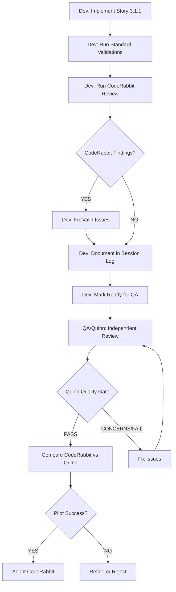

# Story 3.1.1 - CodeRabbit Pilot Integration Plan

**Story**: Epic 3.1.1 - Google AI Studio Setup + Gemini API Integration
**Pilot Purpose**: First real-world test of CodeRabbit VS Code Extension in BMad workflow
**Created**: 2025-10-21
**Status**: Ready to execute when Story 3.1.1 starts

---

## 🎯 Why Story 3.1.1 is Perfect for CodeRabbit Pilot

### Story Characteristics
✅ **Medium complexity** - New API integration (not too simple, not too complex)
✅ **Clear acceptance criteria** - Easy to verify if CodeRabbit helps
✅ **Backend focus** - API integration, error handling, TypeScript
✅ **Will go through QA** - Can compare CodeRabbit findings vs Quinn's review
✅ **Clean slate** - New code, not editing existing implementation

### Expected CodeRabbit Value
- **API integration patterns**: Best practices for Google AI SDK
- **Error handling**: Missing try/catch, unhandled promises
- **TypeScript types**: Missing types, any usage, type safety
- **Testing gaps**: Missing test cases, incomplete coverage
- **Security**: API key handling, input validation

---

## 📋 Enhanced Definition of Done (with CodeRabbit Pilot)

### Standard DoD (From CLAUDE.md)
1. ✅ Build Clean: `npm run build` → 0 errors
2. ✅ All Tests Pass: `npm test` → 100%
3. ✅ Playwright E2E Tests MANDATORY
4. ✅ Screenshots Captured (if UI changes)
5. ✅ Console Error Scanning: ZERO errors
6. ✅ Quality Gate PASS: QA Review with Decision = PASS
7. ✅ Pre-Commit Pass
8. ✅ Session Log Complete

### 🆕 CodeRabbit Pilot Addition (Story 3.1.1 ONLY)
6. ✅ **CodeRabbit Pre-QA Review**:
   - [ ] Run CodeRabbit review before marking "Ready for QA"
   - [ ] Document findings in session log (see template below)
   - [ ] Fix valid issues OR document why skipped
   - [ ] Track false positives for pilot analysis

**Note**: CodeRabbit is **advisory** during pilot - findings don't block story completion, but must be documented for analysis.

---

## 🚀 Workflow Integration for Story 3.1.1

### Phase 1: Implementation (Normal BMad Flow)

```
1. Read Story 3.1.1 acceptance criteria
2. Install @google/generative-ai package
3. Implement Gemini API integration
4. Add error handling & rate limit logic
5. Write tests (unit + integration + E2E)
6. Run standard validations:
   - npm run build
   - npm test
   - npx playwright test
```

### Phase 2: CodeRabbit Pre-QA Review (NEW)

```
7. Open VS Code
8. Press Ctrl+Shift+P → "CodeRabbit: Start Review"
9. Wait for CodeRabbit analysis (sidebar shows progress)
10. Review findings in CodeRabbit sidebar:
    - Click each finding
    - Read inline suggestion
    - Decide: Apply / Ignore / Flag for discussion
11. For each finding, document:
    - Issue description
    - Valid? (Yes/No)
    - Action taken (Applied fix / Ignored / Deferred)
    - Why? (If ignored or deferred)
12. Apply fixes using one-click apply (✓ icon)
13. Re-run validations if code changed
14. Document session in session log (see template)
```

### Phase 3: QA Review (Standard BMad)

```
15. Mark story "Ready for QA Review"
16. Run /bmad.review docs/stories/epic-3.1.story-1.md
17. Quinn performs independent QA review
18. Compare CodeRabbit findings vs Quinn findings
```

### Phase 4: Pilot Analysis

```
19. Answer pilot analysis questions:
    - Did CodeRabbit reduce QA cycles?
    - What % of findings were valid?
    - Time cost vs value gained?
20. Make decision: Adopt / Refine / Reject
21. Update CLAUDE.md if adopting
```

---

## 📊 Session Log Template (Story 3.1.1 with CodeRabbit)

```markdown
# Session Log: Story 3.1.1 - Gemini API Integration

**Date**: YYYY-MM-DD
**Story**: Epic 3.1.1 - Google AI Studio Setup + Gemini API Integration
**Developer**: Dev Agent / User Name
**CodeRabbit Pilot**: YES (First pilot story)

---

## Implementation Summary

### Tasks Completed
- [x] Task 1: Install @google/generative-ai package
- [x] Task 2: Implement Gemini API client
- [x] Task 3: Add error handling
- [x] Task 4: Write tests
- [x] Task 5: Documentation

### Standard Validations
- ✅ Build: 0 errors
- ✅ Tests: 100% pass
- ✅ Playwright: All pass
- ✅ Console errors: 0

---

## 🤖 CodeRabbit Pre-QA Review

### Review Details
- **Ran at**: HH:MM
- **Duration**: X seconds
- **Total findings**: N

### Findings Breakdown

#### Finding 1: [Issue Title]
- **File**: `path/to/file.ts:line`
- **Severity**: Critical / Warning / Info
- **Description**: [What CodeRabbit found]
- **Suggestion**: [What CodeRabbit suggests]
- **Valid?**: ✅ Yes / ❌ No
- **Action**: Applied / Ignored / Deferred
- **Reason**: [Why this action was taken]

#### Finding 2: [Issue Title]
- **File**: `path/to/file.ts:line`
- **Severity**: Critical / Warning / Info
- **Description**: [What CodeRabbit found]
- **Suggestion**: [What CodeRabbit suggests]
- **Valid?**: ✅ Yes / ❌ No
- **Action**: Applied / Ignored / Deferred
- **Reason**: [Why this action was taken]

[... repeat for all findings ...]

### Summary Statistics
- **Total findings**: N
- **Valid findings**: X (X%)
- **False positives**: Y (Y%)
- **Fixes applied**: Z
- **Issues ignored**: W
- **Time spent**: M minutes

---

## Comparison: CodeRabbit vs Quinn QA

### CodeRabbit Findings (Pre-QA)
1. [Issue 1 - Applied]
2. [Issue 2 - Applied]
3. [Issue 3 - False positive]

### Quinn Findings (QA Review)
1. [Issue A - Also found by CodeRabbit? YES/NO]
2. [Issue B - Also found by CodeRabbit? YES/NO]
3. [Issue C - Missed by CodeRabbit]

### Overlap Analysis
- **Caught by both**: X issues
- **Caught by CodeRabbit only**: Y issues
- **Caught by Quinn only**: Z issues
- **False positives (CodeRabbit)**: W issues

---

## Pilot Analysis Questions

### 1. Did CodeRabbit reduce QA round-trips?
**Answer**: YES / NO
**Details**: [Explain - did fixing CodeRabbit findings before QA reduce Quinn's FAIL/CONCERNS?]

### 2. What % of CodeRabbit findings were valid?
**Answer**: X / N = Y%
**Target**: > 90% valid = SUCCESS

### 3. Time cost vs value?
**Time spent on CodeRabbit**: M minutes
**Value gained**: [Describe - issues caught early, time saved, etc.]
**Worth it?**: YES / NO

### 4. False positive rate acceptable?
**False positives**: W / N = Z%
**Target**: < 10% = SUCCESS
**Acceptable?**: YES / NO

### 5. Should we adopt CodeRabbit?
**Decision**: ADOPT / REFINE / REJECT
**Reasoning**: [Explain decision]

---

## Next Steps

- [ ] Complete pilot analysis
- [ ] Update pilot guide with learnings
- [ ] If ADOPT: Update CLAUDE.md with CodeRabbit workflow
- [ ] If REFINE: Document what needs improvement
- [ ] If REJECT: Document why and archive pilot guide
```

---

## 🎯 Success Metrics for Pilot

### Primary Metrics
| Metric | Target | Pass/Fail |
|--------|--------|-----------|
| Valid findings | > 90% | |
| False positives | < 10% | |
| QA round-trips reduced | ≥ 1 fewer cycle | |
| Time cost | < 10 min/story | |

### Qualitative Assessment
- [ ] CodeRabbit findings were actionable
- [ ] Suggestions matched our code style
- [ ] Integration into workflow felt natural
- [ ] Dev experience improved (not frustrated)

**Overall Pilot Success**: If 3/4 primary metrics + 3/4 qualitative = PASS

---

## 📝 Example Usage Pattern

### Scenario: Implementing Gemini API Error Handling

**Step 1: Write initial code**
```typescript
async function callGemini(prompt: string) {
  const result = await gemini.generateContent(prompt);
  return result.response.text();
}
```

**Step 2: Run CodeRabbit**
- Press `Ctrl+Shift+P` → "CodeRabbit: Start Review"

**Step 3: CodeRabbit finds:**
- ❌ Missing error handling for network failures
- ❌ Missing rate limit handling
- ❌ Missing input validation
- ❌ No timeout configuration

**Step 4: Apply fixes**
```typescript
async function callGemini(prompt: string): Promise<string> {
  if (!prompt || prompt.length > 10000) {
    throw new Error('Invalid prompt');
  }

  try {
    const result = await Promise.race([
      gemini.generateContent(prompt),
      new Promise((_, reject) =>
        setTimeout(() => reject(new Error('Timeout')), 30000)
      )
    ]);
    return result.response.text();
  } catch (error) {
    if (error.message.includes('quota')) {
      throw new Error('Gemini rate limit exceeded');
    }
    throw new Error(`Gemini API error: ${error.message}`);
  }
}
```

**Step 5: Document in session log**
- Found 4 valid issues
- Applied all fixes
- 0 false positives
- Time: 5 minutes

**Result**: Code quality improved BEFORE QA review!

---

## 🚫 What NOT to Do During Pilot

### Don't:
❌ Skip documenting findings (even if ignored)
❌ Apply all suggestions blindly (use judgment)
❌ Block story on CodeRabbit findings (it's advisory)
❌ Skip QA review (Quinn is still the authority)
❌ Forget to compare CodeRabbit vs Quinn findings
❌ Rush the pilot (take time to properly document)

### Do:
✅ Document every finding (valid and false positive)
✅ Think critically about each suggestion
✅ Continue with full BMad QA process
✅ Compare findings objectively
✅ Make data-driven adoption decision

---

## 🔄 Integration with BMad Agents

### How CodeRabbit fits with BMad workflow:



### Agent Roles:
- **Dev Agent**: Implements story, runs CodeRabbit, documents findings
- **CodeRabbit**: Pre-QA validation, suggestions (advisory)
- **QA/Quinn**: Independent review, quality gate authority (final decision)
- **User**: Reviews comparison, makes adoption decision

---

## 📅 Timeline for Story 3.1.1 with CodeRabbit

| Phase | Time Estimate | Activity |
|-------|---------------|----------|
| Implementation | 30-60 min | Standard story tasks |
| Standard Validations | 5 min | Build, test, playwright |
| **CodeRabbit Review** | **5-10 min** | **Run review, document findings** |
| **Apply Fixes** | **5-15 min** | **Fix valid issues found** |
| QA Review | 30 min | Quinn's independent review |
| Pilot Analysis | 15 min | Compare, analyze, decide |
| **TOTAL** | **90-130 min** | **(+10-25 min for CodeRabbit)** |

**Cost**: 10-25 min overhead
**Benefit**: Reduced QA cycles, earlier issue detection

---

## ✅ Ready to Execute

When Story 3.1.1 begins:

1. **User/Dev**: Read Story 3.1.1 acceptance criteria
2. **Dev**: Implement normally using BMad workflow
3. **Dev**: Before marking "Ready for QA", run CodeRabbit
4. **Dev**: Document findings using session log template above
5. **Dev**: Mark "Ready for QA"
6. **QA/Quinn**: Run `/bmad.review docs/stories/epic-3.1.story-1.md`
7. **User**: Compare CodeRabbit vs Quinn findings
8. **User**: Make pilot decision (Adopt / Refine / Reject)

---

**Pilot Status**: ✅ Ready to execute
**Next Story**: Epic 3.1.1 (Google AI Studio Setup + Gemini API Integration)
**CodeRabbit Guide**: `docs/development-logs/coderabbit-cli-pilot-guide.md`
