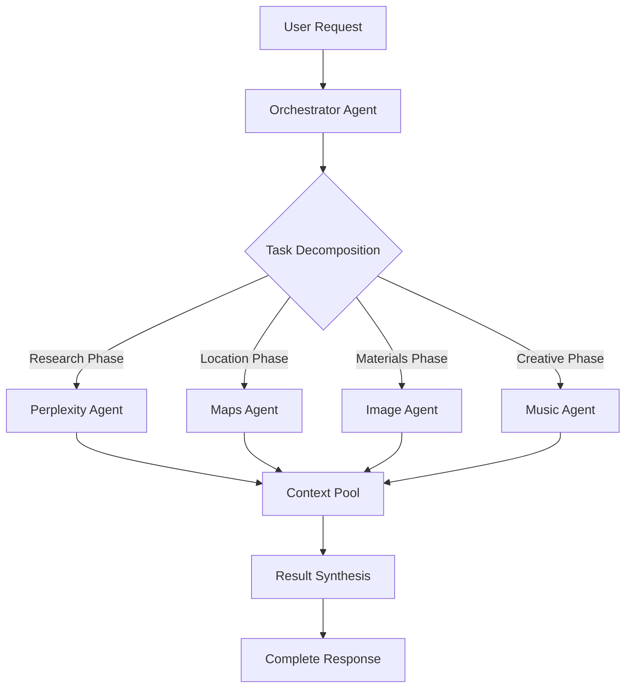

# Epic 5.0: Advanced Educational Agents - Multi-Agent Orchestration

**Epic ID**: Epic 5.0
**Parent PRD**: [docs/prd.md](../prd.md)
**Timeline**: Phase 5 (Weeks 13-18)
**Status**: Planning - Updated with Orchestration & Music
**Priority**: P1 (High Value Features)
**Depends On**: Epic 3.0, 3.1, 3.2, 4.0 (Core Agents + Calendar)

---

## Epic Goal

Implement advanced educational agents with **multi-agent orchestration** for complex tasks: Field Trip Planning (Maps + Research + Image), Research Agent (Perplexity), and Music Creation Agent (Suno) for educational songs.

---

## Epic Context

**Current State**:
- Single agents work independently
- Router classifies single intents
- No agent collaboration

**Target State**:
- Multi-agent orchestration for complex tasks
- Agents collaborate and share context
- Educational songs for memorization
- Complete trip planning with all materials

---

## Business Value

**Field Trip Planning**: Save 3-4 hours (planning + materials)
**Research Agent**: Save 1-2 hours per lesson
**Music Creation**: Improve retention through songs
**Orchestration**: Handle complex multi-step tasks

---

## Technical Integration

### Multi-Agent Orchestration Architecture



### Service Integrations

#### Google Maps Grounding (Gemini)
- **Cost**: $0.025/prompt
- **Use**: Location data, reviews, hours

#### Perplexity API
- **Cost**: ~$0.02/search (estimated)
- **Use**: Research, facts, citations

#### Suno API
- **Cost**: ~$0.006/song (12 credits @ $5/1000)
- **Use**: Educational songs, mnemonics

---

## Multi-Agent Use Cases

### Use Case 1: Complete Field Trip Planning
```
Input: "Plane eine Klassenfahrt nach Berlin zum Thema Deutsche Geschichte"

Orchestration:
1. Research Agent → Historical sites, curriculum alignment
2. Maps Agent → Museums, monuments, distances
3. Research Agent → Educational programs at locations
4. Image Agent → Permission slip template
5. Music Agent → Song about Berlin history
6. Synthesis → Complete trip package
```

### Use Case 2: Thematic Lesson Package
```
Input: "Erstelle Materialien über das Sonnensystem für 5. Klasse"

Orchestration:
1. Research Agent → Age-appropriate facts
2. Image Agent → Planet illustrations
3. Music Agent → "Planets Song" for memorization
4. Research Agent → Fun facts and quiz questions
5. Synthesis → Complete lesson package
```

### Use Case 3: School Event Planning
```
Input: "Plane ein Schulfest zum Thema Umweltschutz"

Orchestration:
1. Research Agent → Eco-friendly activity ideas
2. Maps Agent → Local environmental organizations
3. Image Agent → Poster designs
4. Music Agent → Environmental awareness song
5. Synthesis → Event plan with all materials
```

---

## Stories

### Story 5.0.1: Multi-Agent Orchestrator
**Goal**: Coordinate multiple agents for complex tasks

**Acceptance Criteria**:
1. Task decomposition engine:
   - Analyze request complexity
   - Identify required agents
   - Create execution plan
2. Context sharing between agents:
   - Shared memory pool
   - Pass relevant context
   - Avoid redundant work
3. Parallel vs. sequential execution:
   - Parallel: Independent tasks
   - Sequential: Dependent tasks
4. Result synthesis:
   - Combine agent outputs
   - Resolve conflicts
   - Format unified response
5. Error handling:
   - Fallback strategies
   - Partial result delivery
   - User notification

**Technical Design**:
```typescript
interface OrchestrationPlan {
  tasks: {
    agentType: 'research' | 'maps' | 'image' | 'music';
    input: string;
    dependencies: string[];
    parallel: boolean;
  }[];
  context: SharedContext;
}
```

---

### Story 5.0.2: Field Trip Planning Agent (Orchestrated)
**Goal**: Complete trip planning with all materials

**Acceptance Criteria**:
1. Research Phase (Perplexity):
   - Educational value of destinations
   - Curriculum alignment
   - Safety considerations
   - Cost research
2. Location Phase (Maps):
   - Find relevant locations
   - Calculate routes and times
   - Check accessibility
   - Group bookings info
3. Materials Phase (Image + Docs):
   - Permission slip design
   - Info packet for parents
   - Student worksheets
   - Safety checklist
4. Output Package:
   - Complete itinerary
   - All documents as PDFs
   - Budget breakdown
   - Emergency contacts

**Orchestration Flow**:
```yaml
1. Parse trip requirements
2. Parallel:
   - Research educational sites
   - Find locations on Maps
3. Sequential:
   - Match research with locations
   - Generate optimal route
   - Create materials based on route
4. Synthesize complete package
```

---

### Story 5.0.3: Music Creation Agent (Suno)
**Goal**: Create educational songs for memorization

**Acceptance Criteria**:
1. Song types:
   - Memorization songs (multiplication, vocabulary)
   - Subject songs (history dates, science facts)
   - Class songs (cleanup, morning routine)
   - Event songs (graduation, sports day)
2. German language support:
   - German lyrics generation
   - Age-appropriate language
   - Curriculum-aligned content
3. Music styles:
   - Children's songs (Grundschule)
   - Pop/Rock (Mittelstufe)
   - Various genres (Oberstufe)
4. Integration features:
   - Download MP3/WAV
   - Lyrics sheet generation
   - Save to library
5. Educational enhancement:
   - Rhyme scheme for memorization
   - Repetition for learning
   - Call-and-response patterns

**Technical Integration**:
```typescript
interface SunoRequest {
  prompt: string;
  style: 'children' | 'pop' | 'rock' | 'classical';
  duration: 30 | 60 | 120; // seconds
  language: 'de' | 'en';
  educationalContext: {
    subject: string;
    gradeLevel: string;
    learningObjective: string;
  };
}
```

---

### Story 5.0.4: Research Agent with Citations
**Goal**: Academic research with verifiable sources

**Acceptance Criteria**:
1. Research capabilities:
   - Current events analysis
   - Scientific explanations
   - Historical research
   - Literature analysis
2. Citation formatting:
   - APA/MLA style options
   - Inline citations
   - Bibliography generation
   - Source verification
3. Educational formatting:
   - Grade-appropriate language
   - Key concepts highlighted
   - Visual suggestions
   - Discussion questions
4. Fact-checking:
   - Cross-reference sources
   - Reliability scoring
   - Date verification

---

### Story 5.0.5: Context-Aware Agent Selection
**Goal**: Smart routing based on complex requests

**Acceptance Criteria**:
1. Multi-intent detection:
   - "Research and create image about..."
   - "Plan trip with songs for bus"
   - "Create lesson with all materials"
2. Orchestration triggers:
   - Keywords: "und", "mit", "sowie", "inklusive"
   - Multiple subjects detected
   - Material types mentioned
3. Priority ordering:
   - Research → Visual → Audio
   - Location → Details → Materials
4. Cost optimization:
   - Estimate total cost upfront
   - Warn if exceeding limits
   - Suggest alternatives

---

### Story 5.0.6: Educational Templates & Presets
**Goal**: Pre-configured multi-agent workflows

**Acceptance Criteria**:
1. Field Trip Templates:
   - Tagesausflug Museum
   - Klassenfahrt Großstadt (3 Tage)
   - Naturexkursion
   - Betriebsbesichtigung
2. Lesson Package Templates:
   - Neue Unterrichtseinheit
   - Projektwochen
   - Vertretungsstunde
   - Prüfungsvorbereitung
3. Event Templates:
   - Schulfest
   - Elternabend
   - Sportfest
   - Abschlussfeier
4. Music Templates:
   - Einmaleins-Songs
   - Vokabel-Rap
   - Klassenregeln-Lied
   - Aufräum-Song

---

## Implementation Priorities

### Phase 1: Foundation (Weeks 13-14)
1. Multi-Agent Orchestrator (Story 5.0.1)
2. Context sharing mechanism
3. Basic orchestration for 2 agents

### Phase 2: Core Agents (Weeks 15-16)
1. Research Agent with Perplexity (Story 5.0.4)
2. Music Agent with Suno (Story 5.0.3)
3. Enhanced routing (Story 5.0.5)

### Phase 3: Complex Workflows (Weeks 17-18)
1. Field Trip orchestration (Story 5.0.2)
2. Educational templates (Story 5.0.6)
3. Performance optimization

---

## Cost Projections

**Monthly Estimates** (100 active teachers):
- Google Maps: 2000 prompts × $0.025 = $50
- Perplexity: 3000 searches × $0.02 = $60
- Suno: 500 songs × $0.006 = $3
- Total: ~$113/month

**Limits per Teacher/Day**:
- Maps: 100 prompts (set high initially)
- Research: 200 searches (set high initially)
- Songs: 5 creations
- Orchestrated tasks: 10

---

## Success Metrics

- ✅ Orchestrator handles 5+ agent collaborations
- ✅ Field trips planned in <10 minutes
- ✅ Educational songs improve retention by 30%
- ✅ Teachers save 4+ hours per week
- ✅ 90% of complex requests handled automatically

---

## Risks & Mitigation

| Risk | Impact | Mitigation |
|------|--------|------------|
| Agent coordination complexity | HIGH | Start with 2-agent orchestration |
| Context sharing overhead | MEDIUM | Implement smart caching |
| API rate limits hit | HIGH | Queue management, fallbacks |
| Song quality varies | MEDIUM | Multiple generation attempts |
| Cost overruns | HIGH | Strict per-user limits |

---

## Technical Architecture

### Orchestration Service
```typescript
class OrchestrationService {
  async planExecution(request: string): Promise<OrchestrationPlan>
  async executeParallel(tasks: Task[]): Promise<Results[]>
  async executeSequential(tasks: Task[]): Promise<Results[]>
  async synthesizeResults(results: Results[]): Promise<Response>
  async handleFailure(task: Task, error: Error): Promise<Fallback>
}
```

### Agent Registry
```typescript
const agentRegistry = {
  research: { api: 'perplexity', cost: 0.02 },
  maps: { api: 'gemini-maps', cost: 0.025 },
  image: { api: 'dalle', cost: 0.04 },
  music: { api: 'suno', cost: 0.006 },
  edit: { api: 'gemini-image', cost: 0.039 }
};
```

---

**Epic Owner**: Product Manager
**Technical Lead**: Dev Agent
**QA**: Quinn (Test Architect)
**Created**: 2025-10-20
**Updated**: 2025-10-20
**Status**: DRAFT - Pending Approval