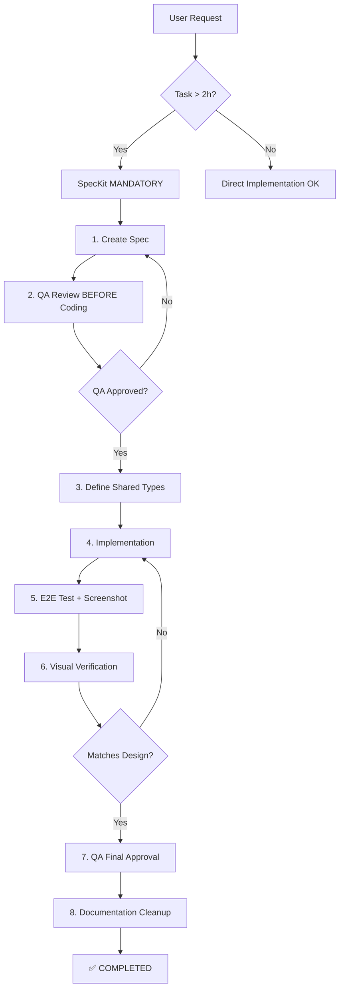

# Perfect Workflow - Teacher Assistant Development

**Version**: 2.0 (Updated 2025-10-05)
**Status**: ✅ Active - Alle Agents MÜSSEN diesem Workflow folgen

---

## 🎯 Workflow Overview



---

## Phase 1: Planning

### 1.1 When to use SpecKit?

**✅ MANDATORY** for:
- Tasks > 2 hours
- Tasks affecting > 2 files
- Bugs with > 1 potential root cause
- Features with UI components
- Architecture changes

**⚪ OPTIONAL** for:
- Typo fixes (< 5 min)
- Single-line bugfixes
- Dependency updates
- Config changes

### 1.2 Create SpecKit

#### A) spec.md (Requirements)
```markdown
# [Feature Name]

## Problem Statement
[WAS wird gelöst?]

## User Stories
1. Als [Rolle] möchte ich [Ziel], damit [Nutzen]

## Success Criteria
- [ ] Criterion 1
- [ ] Criterion 2

## API Contract (wenn nötig)
### Request:
```typescript
interface XxxRequest {
  field: string;
}
```
```

#### B) plan.md (Technical Design)
```markdown
# Implementation Plan

## Architecture
[WIE wird es gebaut?]

## Shared Types
```typescript
// /shared/types/api-contracts.ts
export interface XxxRequest { ... }
```

## Components
- Frontend: XxxComponent.tsx
- Backend: routes/xxx.ts

## Testing Strategy
- Unit Tests: [...]
- E2E Tests: [...]
```

#### C) tasks.md (Implementation Steps)
```markdown
# Tasks

## TASK-001: [Name]
**Status**: ⏳ todo
**Priority**: P0
**Agent**: Backend-Agent
**Estimate**: 2h

**Acceptance Criteria**:
- [ ] Criterion 1
- [ ] E2E test executed with screenshot
- [ ] QA approved
```

### 1.3 🔴 QA Review (MANDATORY!)

**BEFORE any coding starts**:
1. ✅ Request QA-Agent to review spec.md
2. ✅ QA compares with user requirements
3. ✅ QA approves → Start coding
4. ❌ QA rejects → Fix spec first!

**This prevents**: Requirements mismatch (wie Image Gen Modal Bug)

---

## Phase 2: Shared Types (API Integration)

### 2.1 Backend-Agent creates FIRST

**File**: `/teacher-assistant/shared/types/api-contracts.ts`

```typescript
/**
 * [Feature] Request
 * @route POST /api/xxx
 * @frontend XxxComponent.tsx
 * @backend routes/xxx.ts
 */
export interface XxxRequest {
  /** Field description (validation rules) */
  fieldName: string;
}

export interface XxxResponse {
  success: boolean;
  data: { ... };
  error?: string;
}
```

### 2.2 Backend validates with Zod

```typescript
import type { XxxRequest } from '@shared/types/api-contracts';
import { z } from 'zod';

const schema = z.object({
  fieldName: z.string().min(1).max(100)
}) satisfies z.ZodType<XxxRequest>;
```

### 2.3 Frontend imports (never redefines!)

```typescript
// ✅ CORRECT
import type { XxxRequest, XxxResponse } from '@shared/types/api-contracts';

// ❌ WRONG
interface XxxFormData { ... } // DON'T duplicate!
```

---

## Phase 3: Implementation

### 3.1 Code schreiben

**Backend-Agent**:
1. ✅ Shared Types bereits definiert
2. ✅ Zod Validation implementieren
3. ✅ API Route mit TypeScript Types
4. ✅ Unit Tests schreiben

**Frontend-Agent**:
1. ✅ Shared Types importieren
2. ✅ Design Tokens nutzen (nicht hardcoded colors!)
3. ✅ `useStableData()` für InstantDB Arrays
4. ✅ Unit + Integration Tests schreiben

### 3.2 React Best Practices

```typescript
// ❌ WRONG - Infinite Loop
const messages = useMemo(() => data?.messages, [data?.messages]);

// ✅ CORRECT - Stable
import { useStableData } from '@/hooks/useDeepCompareMemo';
const stableMessages = useStableData(data?.messages);
const messages = useMemo(() => stableMessages, [stableMessages]);
```

---

## Phase 4: Testing & Verification (CRITICAL!)

### 4.1 Definition of Done

**Task ist NUR "completed" wenn ALLE ✅**:
1. ✅ Code implementiert
2. ✅ Unit Tests passing (test CORRECT behavior!)
3. ✅ Integration Tests passing
4. ✅ **E2E Test EXECUTED** (nicht nur geschrieben!)
5. ✅ **Screenshot verglichen** mit Design/Spec
6. ✅ **QA-Agent approved** (nicht selbst markieren!)

### 4.2 E2E Test (MANDATORY!)

```bash
cd teacher-assistant/frontend
npm run test:e2e -- [feature-name].spec.ts
```

**Screenshot Verification**:
```typescript
// test.spec.ts
await page.screenshot({ path: 'verify-[feature].png' });
```

Then:
1. ✅ Open screenshot
2. ✅ Compare with design mockup/spec
3. ✅ Document deviations in session log
4. ✅ Only 100% match → mark "completed"

### 4.3 Visual Verification Checklist

- [ ] Colors match Gemini Design (Orange #FB6542, Teal #D3E4E6)
- [ ] Typography matches spec (Inter font, correct sizes)
- [ ] Spacing matches Tailwind standards
- [ ] Mobile-first responsive works
- [ ] All buttons/interactions work
- [ ] No console errors

---

## Phase 5: Documentation & Cleanup

### 5.1 Session Log (MANDATORY)

**File**: `/docs/development-logs/sessions/YYYY-MM-DD/session-XX-[task-name].md`

```markdown
# Session XX: [Feature] - [Task]

**Datum**: 2025-MM-DD
**Agent**: [Name]
**Status**: ✅ Completed
**Related SpecKit**: .specify/specs/[feature]/

## 🎯 Session Ziele
- Ziel 1
- Ziel 2

## 🔧 Implementierungen
- Shared Types erstellt: `api-contracts.ts`
- API Route implementiert: `routes/xxx.ts`
- Frontend Component: `XxxComponent.tsx`

## 📁 Erstellte/Geänderte Dateien
- `/shared/types/api-contracts.ts`: XxxRequest/Response
- `backend/src/routes/xxx.ts`: API implementation
- `frontend/src/components/Xxx.tsx`: UI component

## 🧪 Tests
- Unit Tests: 15/15 passing ✅
- Integration Tests: 3/3 passing ✅
- E2E Test: EXECUTED with screenshot ✅
- Visual Verification: ✅ Matches design 100%

## 🎯 Nächste Schritte
- Next TASK-002: [...]
```

### 5.2 Documentation Cleanup (MANDATORY!)

**NACH Task-Completion**:

| Was | Wohin | Format |
|-----|-------|--------|
| Bug Report | `/docs/quality-assurance/bug-reports/` | `BUG-XXX-[name].md` |
| Fix Summary | `/docs/development-logs/sessions/YYYY-MM-DD/` | `session-XX-[name].md` |
| QA Report | `/docs/quality-assurance/verification-reports/` | `[feature]-verification.md` |
| Deployment Log | `/docs/architecture/deployment-logs/` | `[feature]-deployment.md` |
| Feature Status | `/docs/project-management/feature-tracking/` | `[feature]-status.md` |

**❌ NEVER** leave working docs in project root!

### 5.3 Bug Tracking Update

If Bug-Fix:
1. ✅ Update `/docs/quality-assurance/bug-tracking.md`
2. ✅ Mark bug as "resolved"
3. ✅ Document root cause and solution

---

## Agent-Specific Workflows

### Backend-Agent Checklist

**Before Coding**:
- [ ] Read SpecKit (spec.md + plan.md + tasks.md)
- [ ] Create Shared Types in `/shared/types/api-contracts.ts`
- [ ] Document API route in JSDoc

**During Coding**:
- [ ] Implement with TypeScript strict mode
- [ ] Zod validation against Shared Types
- [ ] German error messages
- [ ] Unit tests for business logic

**After Coding**:
- [ ] Run `npm run type-check` (must pass!)
- [ ] Run `npm test` (all passing!)
- [ ] Create session log
- [ ] Request QA approval

### Frontend-Agent Checklist

**Before Coding**:
- [ ] Read SpecKit
- [ ] Import Shared Types (never redefine!)
- [ ] Review design mockup/spec

**During Coding**:
- [ ] Use Design Tokens (no hardcoded colors!)
- [ ] Use `useStableData()` for InstantDB
- [ ] Mobile-first Tailwind classes
- [ ] Unit + Integration tests

**After Coding**:
- [ ] Execute E2E test
- [ ] Take screenshot
- [ ] Visual verification vs design
- [ ] Create session log
- [ ] Request QA approval

### QA-Agent Checklist

**Spec Review (BEFORE Coding)**:
- [ ] Read spec.md
- [ ] Compare with user requirements
- [ ] Check for requirements mismatch
- [ ] Approve or reject with feedback

**Final Approval (AFTER Implementation)**:
- [ ] Review session log
- [ ] Check E2E test executed
- [ ] Verify screenshot matches design
- [ ] Check all tests passing
- [ ] Approve "completed" status

---

## Anti-Patterns (DON'T DO!)

### ❌ Requirements Mismatch
```
Spec says: "Bildgenerierung mit Beschreibung"
Developer implements: "Arbeitsblatt mit Thema"
Result: Rework needed! ❌
```

**✅ Prevention**: QA reviews spec BEFORE coding

### ❌ Field Name Mismatch
```typescript
// Frontend
{ imageContent: "..." }
// Backend expects
{ description: "..." }
// Result: 400 Bad Request ❌
```

**✅ Prevention**: Use Shared Types!

### ❌ False Completion
```
- Code written ✅
- Tests passing ✅
- E2E test... written but NOT executed ❌
- Screenshot... not taken ❌
- Marked "completed" anyway ❌
Result: Feature broken in production!
```

**✅ Prevention**: Strict Definition of Done!

---

## Success Metrics

### Quality Goals
- Bug Resolution Rate: 100% ✅
- False Completion Rate: < 5% ✅
- SpecKit Compliance: > 90% ✅
- E2E Execution Rate: 100% ✅
- Doc Cleanup: 100% ✅

### Process Compliance
- QA Spec Review: 100% ✅
- Shared Types for API: 100% ✅
- E2E Screenshot: 100% ✅
- Visual Verification: 100% ✅

---

## Quick Reference Cards

### New Feature
```
1. Create SpecKit (spec + plan + tasks)
2. QA reviews spec ✅
3. Define Shared Types
4. Implement + Tests
5. E2E + Screenshot
6. Visual Verification
7. QA approves ✅
8. Cleanup docs
```

### Bug Fix
```
1. Document in bug-tracking.md
2. Root cause analysis
3. SpecKit if complex (>2h)
4. Implement + Tests
5. Session log
6. Mark resolved
7. Cleanup docs
```

### API Integration
```
1. Backend creates Shared Types
2. Backend implements + Zod validation
3. Frontend imports types
4. Both test independently
5. Integration test
6. E2E test
7. QA approval
```

---

## Related Documentation

- **CLAUDE.md**: `/CLAUDE.md` (Main instructions)
- **Agent Workflows**: `/docs/guides/agent-workflows.md`
- **Shared Types README**: `/teacher-assistant/shared/README.md`
- **Quality Analysis**: `/docs/quality-assurance/SPRINT-QUALITY-ANALYSIS-2025-10-05.md`
- **Reorganization Summary**: `/docs/quality-assurance/REORGANIZATION-SUMMARY-2025-10-05.md`

---

**Last Updated**: 2025-10-05
**Version**: 2.0 (Major Process Improvements)
**Maintained By**: All Agents
**Status**: ✅ ACTIVE - Mandatory for all new work
